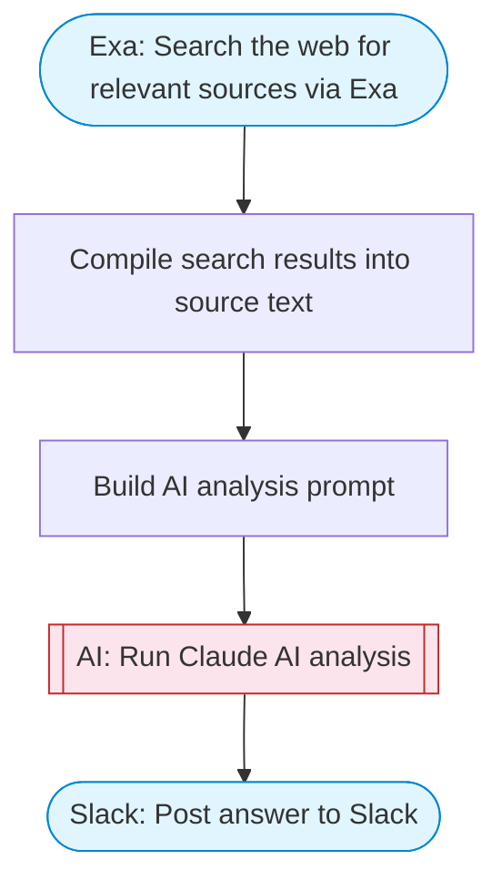

# AI agent chat

An AI-powered chat agent that can search the web to answer user questions. Takes a question, searches the web via Exa for relevant sources, uses Claude to synthesize a comprehensive answer, and delivers the result to Slack with rich Block Kit formatting.

> **Works with any AI agent.** Paste this page's URL into Claude Code, Codex, Cursor, Windsurf, OpenClaw, or any coding agent — it will read the docs, connect your platforms, and run this flow for you.

## Quick Start

```bash
# 1. Connect your platforms (one-time setup)
one add exa
one add slack

# 2. Run the flow
one flow execute n8n-1954-ai-agent-chat \
  --input question="your question here" \
  --input slackChannel="C01ABC123"
```

## Platforms

| Platform | Used for |
|----------|----------|
| Exa | Web search |
| Slack | Posting results |

> Don't have these connected yet? Run `one list` to check, then `one add <platform>` to connect.

## What it does

1. Search the web for relevant sources via Exa
2. Compile search results into source text
3. Build AI analysis prompt
4. Run Claude AI analysis
5. Post answer to Slack

## Flow diagram



## Inputs

| Input | Required | Description |
|-------|----------|-------------|
| `question` | Yes | The user's question to research and answer |
| `slackChannel` | Yes | Slack channel ID to post the answer |

---

<sub>Based on [n8n #1954](https://n8n.io/workflows/1954) · 1.4M views on n8n · by [n8n-team](https://n8n.io/creators/n8n-team) · Converted to One CLI on 2026-03-24</sub>
