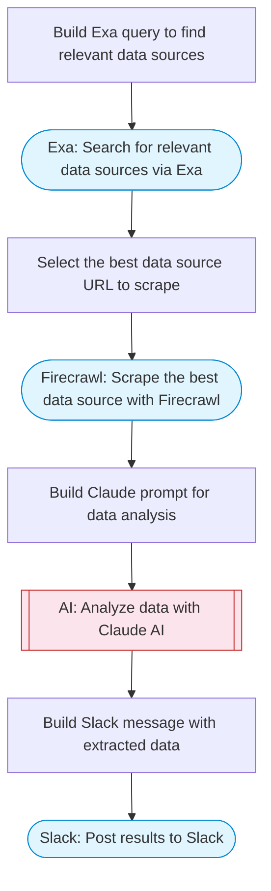

# AI-Powered API Data Fetcher and Analyzer

Takes a natural language query, uses Claude AI to determine what data to fetch, researches relevant APIs via Exa, scrapes the best data source with Firecrawl, analyzes the results with AI, and posts a structured summary to Slack.

> **Works with any AI agent.** Paste this page's URL into Claude Code, Codex, Cursor, Windsurf, OpenClaw, or any coding agent — it will read the docs, connect your platforms, and run this flow for you.

## Quick Start

```bash
# 1. Connect your platforms (one-time setup)
one add exa
one add firecrawl
one add slack

# 2. Run the flow
one flow execute n8n-2094-ai-api-data-fetcher \
  --input query="your question here" \
  --input slackChannel="C01ABC123"
```

## Platforms

| Platform | Used for |
|----------|----------|
| Exa | Api discovery |
| Firecrawl | Data scraping |
| Slack | Post results to Slack |

> Don't have these connected yet? Run `one list` to check, then `one add <platform>` to connect.

## What it does

1. Build Exa query to find relevant data sources
2. Search for relevant data sources via Exa
3. Select the best data source URL to scrape
4. Scrape the best data source with Firecrawl
5. Build Claude prompt for data analysis
6. Analyze data with Claude AI
7. Build Slack message with extracted data
8. Post results to Slack

## Flow diagram



## Inputs

| Input | Required | Description |
|-------|----------|-------------|
| `query` | Yes | Natural language query describing what data to fetch (e.g. 'Get the latest Bitcoin price and 24h change') |
| `slackChannel` | Yes | Slack channel to post results |

---

<sub>Based on [n8n #2094](https://n8n.io/workflows/2094) · 23.2K views on n8n · by [deborah](https://n8n.io/creators/deborah) · Converted to One CLI on 2026-03-25</sub>
