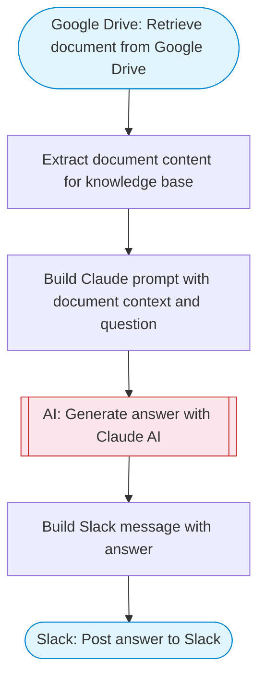

# AI Knowledge Assistant with Google Drive Documents

Retrieves a document from Google Drive, processes it as a knowledge base with Claude AI, allows asking questions against the document content, and posts answers to Slack. Replicates the OpenAI Assistant pattern using Claude.

> **Works with any AI agent.** Paste this page's URL into Claude Code, Codex, Cursor, Windsurf, OpenClaw, or any coding agent — it will read the docs, connect your platforms, and run this flow for you.

## Quick Start

```bash
# 1. Connect your platforms (one-time setup)
one add google-drive
one add slack

# 2. Run the flow
one flow execute n8n-2201-ai-assistant-drive-knowledge \
  --input fileId="..." \
  --input question="your question here" \
  --input slackChannel="C01ABC123" \
  --input assistantRole="..."
```

## Platforms

| Platform | Used for |
|----------|----------|
| Google Drive | Connection key |
| Slack | Post answer to Slack |

> Don't have these connected yet? Run `one list` to check, then `one add <platform>` to connect.

## What it does

1. Retrieve document from Google Drive
2. Extract document content for knowledge base
3. Build Claude prompt with document context and question
4. Generate answer with Claude AI
5. Build Slack message with answer
6. Post answer to Slack

## Flow diagram



## Inputs

| Input | Required | Description |
|-------|----------|-------------|
| `fileId` | Yes | Google Drive file ID containing the knowledge base document |
| `question` | Yes | Question to ask about the document content |
| `slackChannel` | Yes | Slack channel to post the answer |
| `assistantRole` | No | System prompt for the AI assistant (default: You are a helpful knowledge assistant. Answer questions accurately based ONLY on the provided document. If the answer is not in the document, say so.) |

---

<sub>Based on [n8n #2201](https://n8n.io/workflows/2201) · 22.5K views on n8n · by [yulia](https://n8n.io/creators/yulia) · Converted to One CLI on 2026-03-25</sub>
