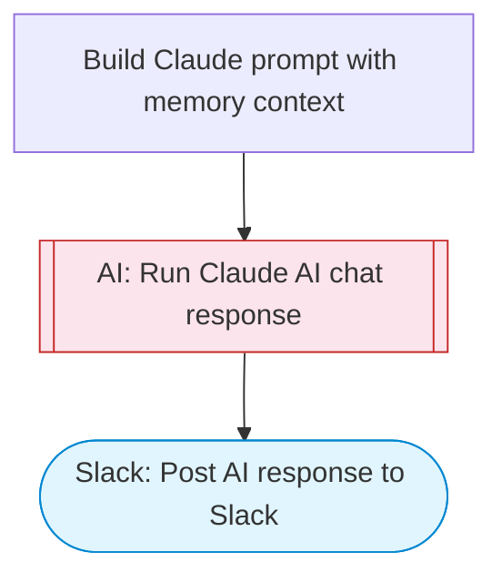

# AI Chat with Memory via Slack

Takes a user question and optional conversation context, uses Claude AI to generate a contextually aware response that maintains conversation continuity, and posts the response to Slack with Block Kit formatting.

> **Works with any AI agent.** Paste this page's URL into Claude Code, Codex, Cursor, Windsurf, OpenClaw, or any coding agent — it will read the docs, connect your platforms, and run this flow for you.

## Quick Start

```bash
# 1. Connect your platforms (one-time setup)
one add slack

# 2. Run the flow
one flow execute n8n-2098-ai-chat-with-memory \
  --input slackChannel="C01ABC123" \
  --input question="your question here" \
  --input conversationContext="..." \
  --input systemRole="..." \
  --input userName="..."
```

## Platforms

| Platform | Used for |
|----------|----------|
| Slack | Posting the response |

> Don't have these connected yet? Run `one list` to check, then `one add <platform>` to connect.

## What it does

1. Build Claude prompt with memory context
2. Run Claude AI chat response
3. Post AI response to Slack

## Flow diagram



## Inputs

| Input | Required | Description |
|-------|----------|-------------|
| `slackChannel` | Yes | Slack channel to post the AI response |
| `question` | Yes | The user's question or message to the AI |
| `conversationContext` | No | Previous conversation context or memory (e.g. prior Q&A pairs, user preferences, session notes) (default: ) |
| `systemRole` | No | AI persona/role (e.g. 'helpful assistant', 'coding expert', 'creative writer', 'business advisor') (default: helpful assistant) |
| `userName` | No | Name of the person asking the question (default: User) |

---

<sub>Based on [n8n #2098](https://n8n.io/workflows/2098) · 66.0K views on n8n · by [davidn8n](https://n8n.io/creators/davidn8n) · Converted to One CLI on 2026-03-25</sub>
