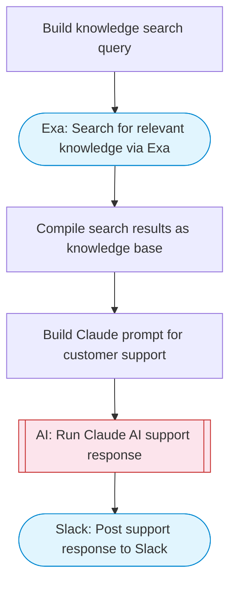

# AI Customer Support Agent

Takes a customer question, uses Exa to search for relevant knowledge base content and documentation, Claude AI crafts a helpful and accurate response grounded in the search results, and posts the answer to Slack with Block Kit formatting.

> **Works with any AI agent.** Paste this page's URL into Claude Code, Codex, Cursor, Windsurf, OpenClaw, or any coding agent — it will read the docs, connect your platforms, and run this flow for you.

## Quick Start

```bash
# 1. Connect your platforms (one-time setup)
one add exa
one add slack

# 2. Run the flow
one flow execute n8n-2846-ai-customer-support \
  --input slackChannel="C01ABC123" \
  --input customerQuestion="your question here" \
  --input companyName="..." \
  --input supportTone="..."
```

## Platforms

| Platform | Used for |
|----------|----------|
| Exa | Knowledge search |
| Slack | Posting the answer |

> Don't have these connected yet? Run `one list` to check, then `one add <platform>` to connect.

## What it does

1. Build knowledge search query
2. Search for relevant knowledge via Exa
3. Compile search results as knowledge base
4. Build Claude prompt for customer support
5. Run Claude AI support response
6. Post support response to Slack

## Flow diagram



## Inputs

| Input | Required | Description |
|-------|----------|-------------|
| `slackChannel` | Yes | Slack channel to post the support response |
| `customerQuestion` | Yes | The customer's question or support request |
| `companyName` | No | Company name for context (helps with knowledge search) (default: ) |
| `supportTone` | No | Tone for the support response: friendly, formal, technical, casual (default: friendly and professional) |

---

<sub>Based on [n8n #2846](https://n8n.io/workflows/2846) · 67.5K views on n8n · by [n3witalia](https://n8n.io/creators/n3witalia) · Converted to One CLI on 2026-03-25</sub>
