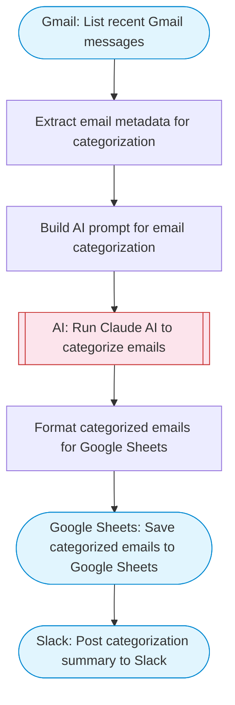

# AI email categorizer with Gmail and Slack alerts

Lists recent Gmail messages, uses Claude AI to categorize each email by type and priority, saves the categorized results to Google Sheets, and posts a summary to Slack.

> **Works with any AI agent.** Paste this page's URL into Claude Code, Codex, Cursor, Windsurf, OpenClaw, or any coding agent — it will read the docs, connect your platforms, and run this flow for you.

## Quick Start

```bash
# 1. Connect your platforms (one-time setup)
one add gmail
one add google-sheets
one add slack

# 2. Run the flow
one flow execute n8n-2358-ai-email-categorizer \
  --input slackChannel="C01ABC123" \
  --input maxEmails="user@example.com" \
  --input categories="..."
```

## Platforms

| Platform | Used for |
|----------|----------|
| Gmail | Listing emails |
| Google Sheets | Saving categorized results |
| Slack | Posting summary |

> Don't have these connected yet? Run `one list` to check, then `one add <platform>` to connect.

## What it does

1. List recent Gmail messages
2. Extract email metadata for categorization
3. Build AI prompt for email categorization
4. Run Claude AI to categorize emails
5. Format categorized emails for Google Sheets
6. Save categorized emails to Google Sheets
7. Post categorization summary to Slack

## Flow diagram



## Inputs

| Input | Required | Description |
|-------|----------|-------------|
| `slackChannel` | Yes | Slack channel ID for the categorization summary |
| `maxEmails` | No | Maximum number of recent emails to categorize (default 20) (default: 20) |
| `categories` | No | Comma-separated list of email categories to use (default: Work, Personal, Marketing, Notifications, Urgent, Spam) |

---

<sub>Based on [n8n #2358](https://n8n.io/workflows/2358) · 26.1K views on n8n · by [max-n8n](https://n8n.io/creators/max-n8n) · Converted to One CLI on 2026-03-25</sub>
