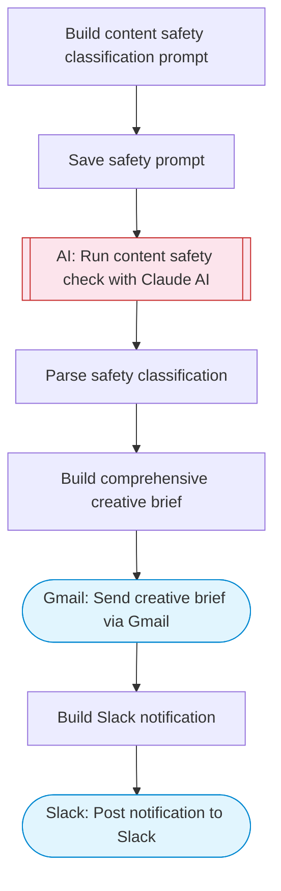

# AI image generator from text with content safety filtering

Takes a text prompt, runs content safety classification with Claude AI to filter inappropriate requests, generates a detailed image description and creative brief, delivers the results via Gmail, and notifies Slack.

> **Works with any AI agent.** Paste this page's URL into Claude Code, Codex, Cursor, Windsurf, OpenClaw, or any coding agent — it will read the docs, connect your platforms, and run this flow for you.

## Quick Start

```bash
# 1. Connect your platforms (one-time setup)
one add gmail
one add slack

# 2. Run the flow
one flow execute n8n-4108-ai-image-generator \
  --input prompt="..." \
  --input style="..." \
  --input recipientEmail="user@example.com" \
  --input slackChannel="C01ABC123"
```

## Platforms

| Platform | Used for |
|----------|----------|
| Gmail | Delivering results |
| Slack | Notifications |

> Don't have these connected yet? Run `one list` to check, then `one add <platform>` to connect.

## What it does

1. Build content safety classification prompt
2. Save safety prompt
3. Run content safety check with Claude AI
4. Parse safety classification
5. Build comprehensive creative brief
6. Send creative brief via Gmail
7. Post notification to Slack

## Flow diagram



## Inputs

| Input | Required | Description |
|-------|----------|-------------|
| `prompt` | Yes | Text description of the image to generate |
| `style` | No | Image style: photorealistic, illustration, 3d-render, watercolor, pencil-sketch (default: photorealistic) |
| `recipientEmail` | Yes | Email to send the image brief to |
| `slackChannel` | Yes | Slack channel for notifications |

---

<sub>Based on [n8n #4108](https://n8n.io/workflows/4108) · 27.3K views on n8n · by [n8n-team](https://n8n.io/creators/n8n-team) · Converted to One CLI on 2026-03-25</sub>
