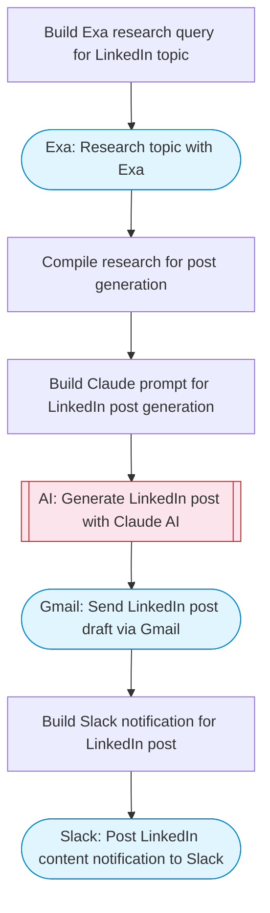

# Generate AI-powered LinkedIn posts with content strategy and research

Takes a topic, researches it with Exa web search, generates a LinkedIn-optimized post with Claude AI including hashtags and hook, and delivers the ready-to-publish content via Gmail and Slack notification.

> **Works with any AI agent.** Paste this page's URL into Claude Code, Codex, Cursor, Windsurf, OpenClaw, or any coding agent — it will read the docs, connect your platforms, and run this flow for you.

## Quick Start

```bash
# 1. Connect your platforms (one-time setup)
one add exa
one add gmail
one add slack

# 2. Run the flow
one flow execute n8n-5002-ai-linkedin-posts \
  --input topic="your topic here" \
  --input tone="..." \
  --input recipientEmail="user@example.com" \
  --input slackChannel="C01ABC123"
```

## Platforms

| Platform | Used for |
|----------|----------|
| Exa | Topic research |
| Gmail | Delivering the post |
| Slack | Notifications |

> Don't have these connected yet? Run `one list` to check, then `one add <platform>` to connect.

## What it does

1. Build Exa research query for LinkedIn topic
2. Research topic with Exa
3. Compile research for post generation
4. Build Claude prompt for LinkedIn post generation
5. Generate LinkedIn post with Claude AI
6. Send LinkedIn post draft via Gmail
7. Post LinkedIn content notification to Slack

## Flow diagram



## Inputs

| Input | Required | Description |
|-------|----------|-------------|
| `topic` | Yes | Topic for the LinkedIn post (e.g. 'AI in enterprise sales') |
| `tone` | No | Desired tone (e.g. 'thought leadership', 'casual', 'data-driven') (default: professional yet conversational) |
| `recipientEmail` | Yes | Email to send the finished post for review |
| `slackChannel` | Yes | Slack channel for post notifications |

---

<sub>Based on [n8n #5002](https://n8n.io/workflows/5002) · 28.0K views on n8n · by [evoortsolutions](https://n8n.io/creators/evoortsolutions) · Converted to One CLI on 2026-03-25</sub>
