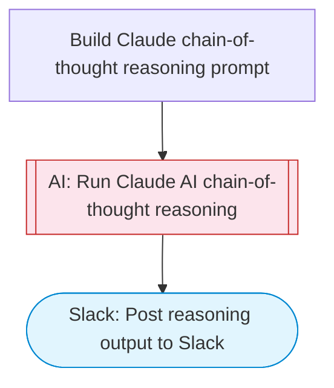

# AI Reasoning Demo — Claude Chain-of-Thought to Slack

Takes a question or problem, uses Claude AI with explicit chain-of-thought reasoning to work through it step by step, and posts the full reasoning process plus conclusion to Slack with Block Kit formatting.

> **Works with any AI agent.** Paste this page's URL into Claude Code, Codex, Cursor, Windsurf, OpenClaw, or any coding agent — it will read the docs, connect your platforms, and run this flow for you.

## Quick Start

```bash
# 1. Connect your platforms (one-time setup)
one add slack

# 2. Run the flow
one flow execute n8n-2777-ai-reasoning-demo \
  --input slackChannel="C01ABC123" \
  --input question="your question here" \
  --input reasoningDepth="..."
```

## Platforms

| Platform | Used for |
|----------|----------|
| Slack | Post reasoning output to Slack |

> Don't have these connected yet? Run `one list` to check, then `one add <platform>` to connect.

## What it does

1. Build Claude chain-of-thought reasoning prompt
2. Run Claude AI chain-of-thought reasoning
3. Post reasoning output to Slack

## Flow diagram



## Inputs

| Input | Required | Description |
|-------|----------|-------------|
| `slackChannel` | Yes | Slack channel ID to post the reasoning output |
| `question` | Yes | Question or problem for chain-of-thought reasoning (e.g. 'What are the pros and cons of microservices vs monolith?') |
| `reasoningDepth` | No | Reasoning depth: quick, thorough, or exhaustive (default: thorough) |

---

<sub>Based on [n8n #2777](https://n8n.io/workflows/2777) · 40.1K views on n8n · by [joe](https://n8n.io/creators/joe) · Converted to One CLI on 2026-03-25</sub>
