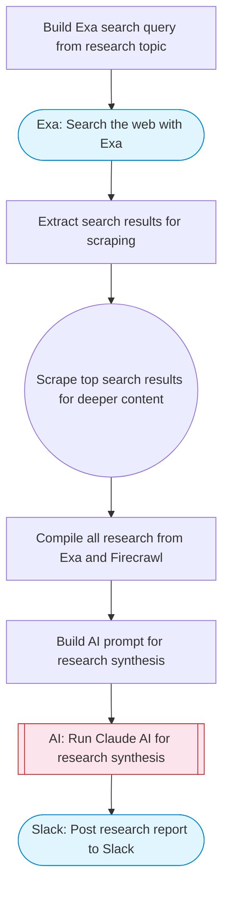

# AI-powered web researcher with Exa search and Slack delivery

Uses Exa to search the web for a given research topic, scrapes the top results with Firecrawl, uses Claude AI to synthesize findings into a comprehensive research report, and posts it to Slack.

> **Works with any AI agent.** Paste this page's URL into Claude Code, Codex, Cursor, Windsurf, OpenClaw, or any coding agent — it will read the docs, connect your platforms, and run this flow for you.

## Quick Start

```bash
# 1. Connect your platforms (one-time setup)
one add exa
one add firecrawl
one add slack

# 2. Run the flow
one flow execute n8n-2768-ai-researcher-web-search \
  --input slackChannel="C01ABC123" \
  --input researchTopic="your topic here" \
  --input maxSources="10"
```

## Platforms

| Platform | Used for |
|----------|----------|
| Exa | Web search |
| Firecrawl | Scraping search results |
| Slack | Posting the research report |

> Don't have these connected yet? Run `one list` to check, then `one add <platform>` to connect.

## What it does

1. Build Exa search query from research topic
2. Search the web with Exa
3. Extract search results for scraping
4. Scrape top search results for deeper content
5. Compile all research from Exa and Firecrawl
6. Build AI prompt for research synthesis
7. Run Claude AI for research synthesis
8. Post research report to Slack

## Flow diagram



## Inputs

| Input | Required | Description |
|-------|----------|-------------|
| `slackChannel` | Yes | Slack channel ID for the research report |
| `researchTopic` | Yes | Research topic or question (e.g. 'Latest developments in quantum computing 2025') |
| `maxSources` | No | Maximum number of sources to research (default 5) (default: 5) |

---

<sub>Based on [n8n #2768](https://n8n.io/workflows/2768) · 25.7K views on n8n · by [joe](https://n8n.io/creators/joe) · Converted to One CLI on 2026-03-25</sub>
