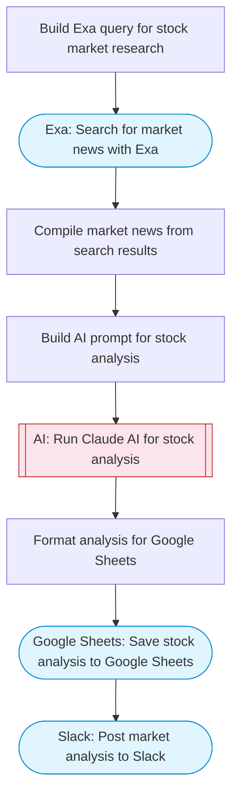

# AI stock market analyzer with Exa research and Sheets tracking

Searches for latest stock market news and analysis using Exa, uses Claude AI to analyze market trends and generate trading insights, and saves the analysis to Google Sheets for tracking.

> **Works with any AI agent.** Paste this page's URL into Claude Code, Codex, Cursor, Windsurf, OpenClaw, or any coding agent — it will read the docs, connect your platforms, and run this flow for you.

## Quick Start

```bash
# 1. Connect your platforms (one-time setup)
one add exa
one add google-sheets
one add slack

# 2. Run the flow
one flow execute n8n-5711-ai-stock-analysis-sheets \
  --input slackChannel="C01ABC123" \
  --input stockSymbols="..." \
  --input investmentStyle="..."
```

## Platforms

| Platform | Used for |
|----------|----------|
| Exa | Searching financial news |
| Google Sheets | Saving analysis |
| Slack | Posting market alerts |

> Don't have these connected yet? Run `one list` to check, then `one add <platform>` to connect.

## What it does

1. Build Exa query for stock market research
2. Search for market news with Exa
3. Compile market news from search results
4. Build AI prompt for stock analysis
5. Run Claude AI for stock analysis
6. Format analysis for Google Sheets
7. Save stock analysis to Google Sheets
8. Post market analysis to Slack

## Flow diagram



## Inputs

| Input | Required | Description |
|-------|----------|-------------|
| `slackChannel` | Yes | Slack channel ID for market analysis alerts |
| `stockSymbols` | Yes | Comma-separated stock symbols to analyze (e.g. 'AAPL, MSFT, GOOGL, TSLA') |
| `investmentStyle` | No | Investment style preference (e.g. 'conservative', 'moderate growth', 'aggressive') (default: moderate growth) |

---

<sub>Based on [n8n #5711](https://n8n.io/workflows/5711) · 26.4K views on n8n · by [raz-hadas](https://n8n.io/creators/raz-hadas) · Converted to One CLI on 2026-03-25</sub>
