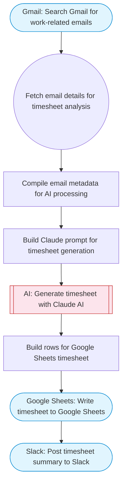

# AI Timesheet Generator from Gmail and Calendar to Google Sheets

Collects recent emails from Gmail, uses Claude AI to extract work activities and time estimates, compiles an automated timesheet, and writes structured time entries to Google Sheets with a Slack summary.

> **Works with any AI agent.** Paste this page's URL into Claude Code, Codex, Cursor, Windsurf, OpenClaw, or any coding agent — it will read the docs, connect your platforms, and run this flow for you.

## Quick Start

```bash
# 1. Connect your platforms (one-time setup)
one add gmail
one add google-sheets
one add slack

# 2. Run the flow
one flow execute n8n-5396-ai-timesheet-generator \
  --input spreadsheetId="..." \
  --input sheetName="..." \
  --input timePeriod="..." \
  --input slackChannel="C01ABC123" \
  --input hourlyRate="https://example.com"
```

## Platforms

| Platform | Used for |
|----------|----------|
| Gmail | Reading work emails |
| Google Sheets | Connection key |
| Slack | Timesheet notification |

> Don't have these connected yet? Run `one list` to check, then `one add <platform>` to connect.

## What it does

1. Search Gmail for work-related emails
2. Fetch email details for timesheet analysis
3. Compile email metadata for AI processing
4. Build Claude prompt for timesheet generation
5. Generate timesheet with Claude AI
6. Build rows for Google Sheets timesheet
7. Write timesheet to Google Sheets
8. Post timesheet summary to Slack

## Flow diagram



## Inputs

| Input | Required | Description |
|-------|----------|-------------|
| `spreadsheetId` | Yes | Google Sheets spreadsheet ID for timesheet |
| `sheetName` | No | Sheet tab name (default: Timesheet) |
| `timePeriod` | No | Time period to analyze (e.g. 7d for last week) (default: 7d) |
| `slackChannel` | Yes | Slack channel to post timesheet summary |
| `hourlyRate` | No | Optional hourly rate for billing calculation (default: 0) |

---

<sub>Based on [n8n #5396](https://n8n.io/workflows/5396) · 22.0K views on n8n · by [zivkovic58](https://n8n.io/creators/zivkovic58) · Converted to One CLI on 2026-03-25</sub>
