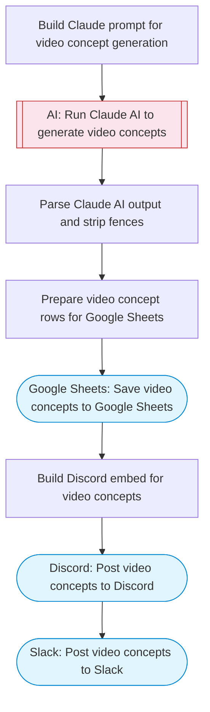

# AI Video Generation & Multi-Platform Publish

Claude AI generates creative video concepts with scene descriptions, image prompts, and scripts, saves them to Google Sheets for tracking, then posts formatted announcements to both Discord and Slack channels.

> **Works with any AI agent.** Paste this page's URL into Claude Code, Codex, Cursor, Windsurf, OpenClaw, or any coding agent — it will read the docs, connect your platforms, and run this flow for you.

## Quick Start

```bash
# 1. Connect your platforms (one-time setup)
one add google-sheets
one add slack
one add discord

# 2. Run the flow
one flow execute n8n-3442-ai-video-gen-multiplatform \
  --input slackChannel="C01ABC123" \
  --input discordChannelId="C01ABC123" \
  --input spreadsheetId="..." \
  --input sheetName="..." \
  --input topic="your topic here" \
  --input videoCount="..."
```

## Platforms

| Platform | Used for |
|----------|----------|
| Google Sheets | Saving video concepts |
| Slack | Posting video announcements |
| Discord | Posting video announcements |

> Don't have these connected yet? Run `one list` to check, then `one add <platform>` to connect.

## What it does

1. Build Claude prompt for video concept generation
2. Run Claude AI to generate video concepts
3. Parse Claude AI output and strip fences
4. Prepare video concept rows for Google Sheets
5. Save video concepts to Google Sheets
6. Build Discord embed for video concepts
7. Post video concepts to Discord
8. Post video concepts to Slack

## Flow diagram



## Inputs

| Input | Required | Description |
|-------|----------|-------------|
| `slackChannel` | Yes | Slack channel to post video announcements (e.g. '#video-content') |
| `discordChannelId` | Yes | Discord channel ID to post video announcements |
| `spreadsheetId` | Yes | Google Sheets spreadsheet ID for video concept tracking |
| `sheetName` | No | Sheet tab name (default: 'Video Concepts') (default: Video Concepts) |
| `topic` | Yes | Topic or niche for video generation (e.g. 'AI tutorials', 'cooking hacks', 'tech reviews') |
| `videoCount` | No | Number of video concepts to generate (default: 3) (default: 3) |

---

<sub>Based on [n8n #3442](https://n8n.io/workflows/3442) · 247.9K views on n8n · by [carlosgracia](https://n8n.io/creators/carlosgracia) · Converted to One CLI on 2026-03-25</sub>
