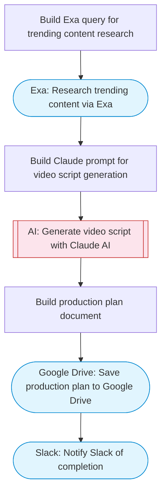

# AI Video Script and Production Plan Generator

Takes a text topic, researches trending content via Exa, generates a detailed video script with Claude AI including avatar selection and voice notes, and saves the production plan to Google Drive with a Slack notification.

> **Works with any AI agent.** Paste this page's URL into Claude Code, Codex, Cursor, Windsurf, OpenClaw, or any coding agent — it will read the docs, connect your platforms, and run this flow for you.

## Quick Start

```bash
# 1. Connect your platforms (one-time setup)
one add exa
one add google-drive
one add slack

# 2. Run the flow
one flow execute n8n-3054-ai-video-script-generator \
  --input topic="your topic here" \
  --input targetDuration="..." \
  --input tone="..." \
  --input slackChannel="C01ABC123"
```

## Platforms

| Platform | Used for |
|----------|----------|
| Exa | Content research |
| Google Drive | Connection key |
| Slack | Notify Slack of completion |

> Don't have these connected yet? Run `one list` to check, then `one add <platform>` to connect.

## What it does

1. Build Exa query for trending content research
2. Research trending content via Exa
3. Build Claude prompt for video script generation
4. Generate video script with Claude AI
5. Build production plan document
6. Save production plan to Google Drive
7. Notify Slack of completion

## Flow diagram



## Inputs

| Input | Required | Description |
|-------|----------|-------------|
| `topic` | Yes | Video topic or text to convert into a video script |
| `targetDuration` | No | Target video duration in seconds (default: 60) |
| `tone` | No | Video tone: professional, casual, educational, entertaining (default: professional) |
| `slackChannel` | Yes | Slack channel for notification |

---

<sub>Based on [n8n #3054](https://n8n.io/workflows/3054) · 22.4K views on n8n · by [n8ninja](https://n8n.io/creators/n8ninja) · Converted to One CLI on 2026-03-25</sub>
