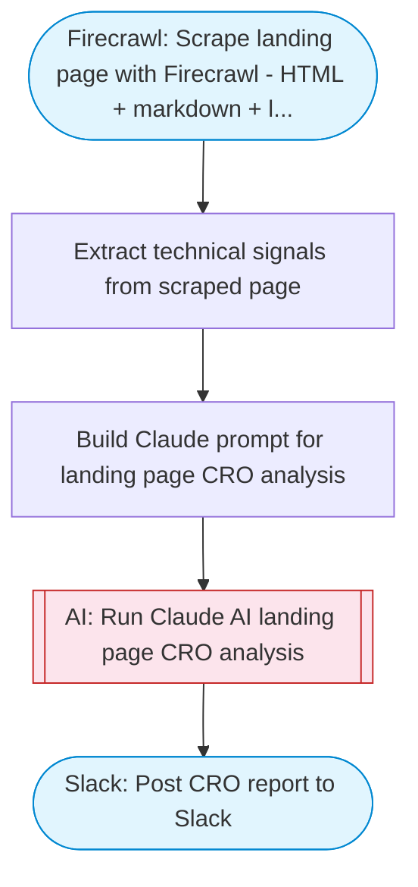

# AI Landing Page Analyzer

Takes a URL, scrapes the landing page with Firecrawl (HTML + markdown + links), then uses Claude AI to perform a deep conversion rate optimization analysis covering copy, CTAs, UX, trust signals, mobile experience, and page structure. Outputs a detailed report to Slack using Block Kit.

> **Works with any AI agent.** Paste this page's URL into Claude Code, Codex, Cursor, Windsurf, OpenClaw, or any coding agent — it will read the docs, connect your platforms, and run this flow for you.

## Quick Start

```bash
# 1. Connect your platforms (one-time setup)
one add firecrawl
one add slack

# 2. Run the flow
one flow execute n8n-3100-analyze-landing-page \
  --input url="https://example.com" \
  --input businessContext="..." \
  --input slackChannel="C01ABC123"
```

## Platforms

| Platform | Used for |
|----------|----------|
| Firecrawl | Scrape landing page with Firecrawl (HTML + markdown + links) |
| Slack | Post CRO report to Slack |

> Don't have these connected yet? Run `one list` to check, then `one add <platform>` to connect.

## What it does

1. Scrape landing page with Firecrawl (HTML + markdown + links)
2. Extract technical signals from scraped page
3. Build Claude prompt for landing page CRO analysis
4. Run Claude AI landing page CRO analysis
5. Post CRO report to Slack

## Flow diagram



## Inputs

| Input | Required | Description |
|-------|----------|-------------|
| `url` | Yes | Landing page URL to analyze (e.g. 'https://example.com/pricing') |
| `businessContext` | No | Optional context about the business or product (helps AI give more relevant advice) (default: ) |
| `slackChannel` | Yes | Slack channel ID to post the analysis report |

---

<sub>Based on [n8n #3100](https://n8n.io/workflows/3100) · 204.6K views on n8n · by [notanothermarketer](https://n8n.io/creators/notanothermarketer) · Converted to One CLI on 2026-03-24</sub>
