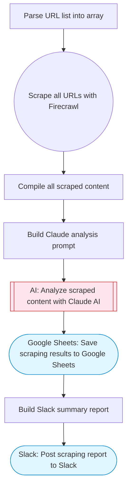

# Scrape any URL without getting blocked using Firecrawl

Scrapes one or more URLs using Firecrawl (which handles anti-bot technologies), extracts and analyzes the content with Claude AI, saves results to Google Sheets, and notifies Slack with a summary.

> **Works with any AI agent.** Paste this page's URL into Claude Code, Codex, Cursor, Windsurf, OpenClaw, or any coding agent — it will read the docs, connect your platforms, and run this flow for you.

## Quick Start

```bash
# 1. Connect your platforms (one-time setup)
one add firecrawl
one add google-sheets
one add slack

# 2. Run the flow
one flow execute n8n-2299-anti-bot-web-scraper \
  --input urls="https://example.com" \
  --input slackChannel="C01ABC123" \
  --input extractionGoal="..."
```

## Platforms

| Platform | Used for |
|----------|----------|
| Firecrawl | Web scraping |
| Google Sheets | Saving results |
| Slack | Notifications |

> Don't have these connected yet? Run `one list` to check, then `one add <platform>` to connect.

## What it does

1. Parse URL list into array
2. Scrape all URLs with Firecrawl
3. Compile all scraped content
4. Build Claude analysis prompt
5. Analyze scraped content with Claude AI
6. Save scraping results to Google Sheets
7. Post scraping report to Slack

## Flow diagram



## Inputs

| Input | Required | Description |
|-------|----------|-------------|
| `urls` | Yes | Comma-separated list of URLs to scrape (e.g. 'https://example.com,https://other.com') |
| `slackChannel` | Yes | Slack channel for scraping results |
| `extractionGoal` | No | What to extract from the scraped pages (default: Extract all key information, data, and structured content) |

---

<sub>Based on [n8n #2299](https://n8n.io/workflows/2299) · 28.0K views on n8n · by [bwiertz](https://n8n.io/creators/bwiertz) · Converted to One CLI on 2026-03-25</sub>
