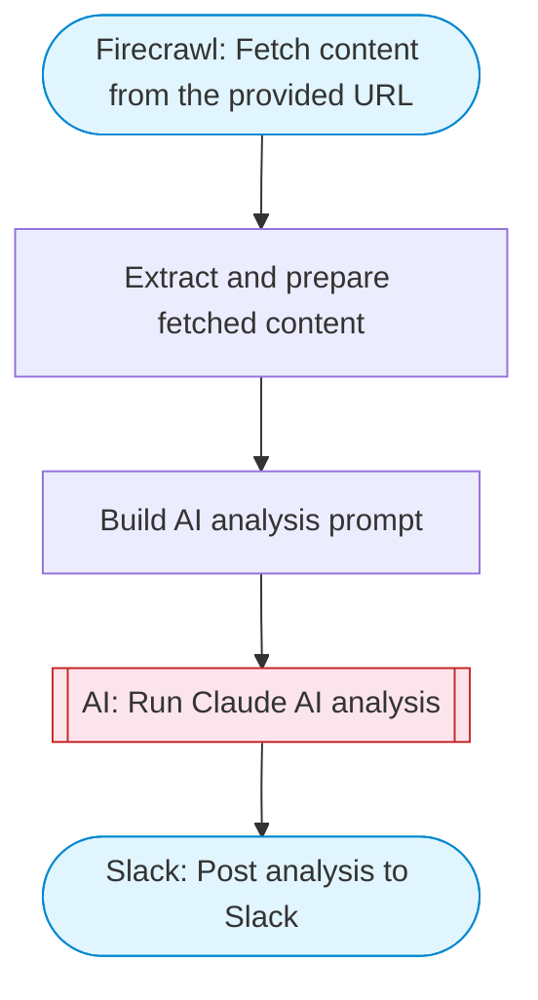

# HTTP Data Fetcher with AI Summary

Fetch data from any URL, have Claude AI summarize and analyze the content, then post a formatted report to Slack using Block Kit.

> **Works with any AI agent.** Paste this page's URL into Claude Code, Codex, Cursor, Windsurf, OpenClaw, or any coding agent — it will read the docs, connect your platforms, and run this flow for you.

## Quick Start

```bash
# 1. Connect your platforms (one-time setup)
one add firecrawl
one add slack

# 2. Run the flow
one flow execute n8n-1750-api-endpoint \
  --input url="https://example.com" \
  --input slackChannel="C01ABC123"
```

## Platforms

| Platform | Used for |
|----------|----------|
| Firecrawl | Fetch content from the provided URL |
| Slack | Post analysis to Slack |

> Don't have these connected yet? Run `one list` to check, then `one add <platform>` to connect.

## What it does

1. Fetch content from the provided URL
2. Extract and prepare fetched content
3. Build AI analysis prompt
4. Run Claude AI analysis
5. Post analysis to Slack

## Flow diagram



## Inputs

| Input | Required | Description |
|-------|----------|-------------|
| `url` | Yes | URL to fetch and analyze (any web page or API endpoint) |
| `slackChannel` | Yes | Slack channel ID to post the summary |

---

<sub>Based on [n8n #1750](https://n8n.io/workflows/1750) · 449.5K views on n8n · by [jon-n8n](https://n8n.io/creators/jon-n8n) · Converted to One CLI on 2026-03-24</sub>
