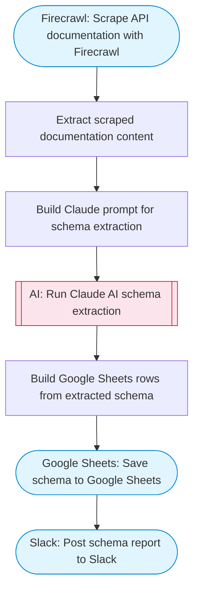

# API schema extractor and classifier

Takes an API documentation URL, scrapes it with Firecrawl, uses Claude AI to extract and classify API endpoints into structured schemas, and saves the results to Google Sheets. Adapted from n8n's API schema extractor workflow.

> **Works with any AI agent.** Paste this page's URL into Claude Code, Codex, Cursor, Windsurf, OpenClaw, or any coding agent — it will read the docs, connect your platforms, and run this flow for you.

## Quick Start

```bash
# 1. Connect your platforms (one-time setup)
one add firecrawl
one add google-sheets
one add slack

# 2. Run the flow
one flow execute n8n-2658-api-schema-extractor \
  --input slackChannel="C01ABC123" \
  --input apiDocsUrl="https://example.com" \
  --input spreadsheetId="..." \
  --input apiName="..."
```

## Platforms

| Platform | Used for |
|----------|----------|
| Firecrawl | Scraping api docs |
| Google Sheets | Saving schema |
| Slack | Notification |

> Don't have these connected yet? Run `one list` to check, then `one add <platform>` to connect.

## What it does

1. Scrape API documentation with Firecrawl
2. Extract scraped documentation content
3. Build Claude prompt for schema extraction
4. Run Claude AI schema extraction
5. Save schema to Google Sheets
6. Post schema report to Slack

## Flow diagram



## Inputs

| Input | Required | Description |
|-------|----------|-------------|
| `slackChannel` | Yes | Slack channel ID for extraction results |
| `apiDocsUrl` | Yes | URL of the API documentation to extract (e.g. 'https://api.example.com/docs') |
| `spreadsheetId` | Yes | Google Sheets spreadsheet ID for the schema output |
| `apiName` | No | Name of the API for labeling (default: API) |

---

<sub>Based on [n8n #2658](https://n8n.io/workflows/2658) · 29.4K views on n8n · by [polina-n8n](https://n8n.io/creators/polina-n8n) · Converted to One CLI on 2026-03-25</sub>
