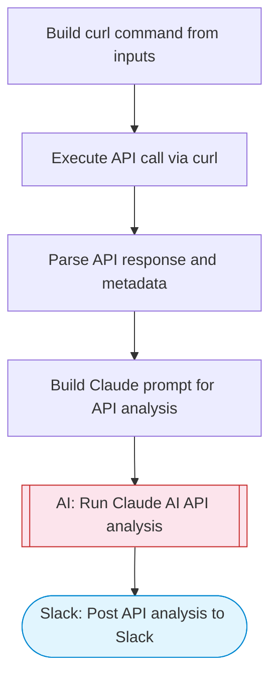

# AI API Response Tester

Fetches data from a user-provided API URL, uses Claude AI to analyze the response structure, data quality, and potential issues, and posts a comprehensive API analysis report to Slack with Block Kit formatting. Adapted from n8n's interactive API fundamentals tutorial workflow.

> **Works with any AI agent.** Paste this page's URL into Claude Code, Codex, Cursor, Windsurf, OpenClaw, or any coding agent — it will read the docs, connect your platforms, and run this flow for you.

## Quick Start

```bash
# 1. Connect your platforms (one-time setup)
one add slack

# 2. Run the flow
one flow execute n8n-5171-api-tester \
  --input slackChannel="C01ABC123" \
  --input apiUrl="https://example.com" \
  --input httpMethod="..." \
  --input headers="..." \
  --input requestBody="..."
```

## Platforms

| Platform | Used for |
|----------|----------|
| Slack | Posting the analysis |

> Don't have these connected yet? Run `one list` to check, then `one add <platform>` to connect.

## What it does

1. Build curl command from inputs
2. Execute API call via curl
3. Parse API response and metadata
4. Build Claude prompt for API analysis
5. Run Claude AI API analysis
6. Post API analysis to Slack

## Flow diagram



## Inputs

| Input | Required | Description |
|-------|----------|-------------|
| `slackChannel` | Yes | Slack channel ID to post the API analysis |
| `apiUrl` | Yes | The API endpoint URL to test (e.g. https://api.example.com/v1/data) |
| `httpMethod` | No | HTTP method: GET, POST, PUT, DELETE (default: GET) (default: GET) |
| `headers` | No | Optional HTTP headers as JSON string (e.g. {"Authorization": "Bearer token"}) (default: ) |
| `requestBody` | No | Optional request body for POST/PUT requests (JSON string) (default: ) |

---

<sub>Based on [n8n #5171](https://n8n.io/workflows/5171) · 45.2K views on n8n · by [lucaspeyrin](https://n8n.io/creators/lucaspeyrin) · Converted to One CLI on 2026-03-25</sub>
