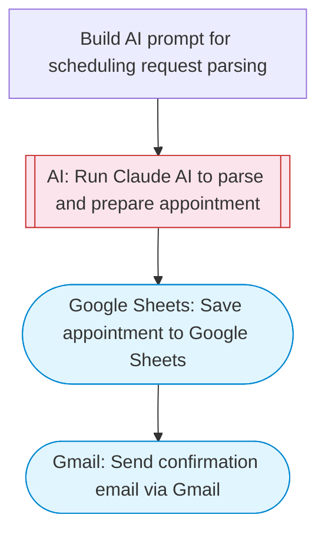

# AI appointment scheduler with Sheets and email confirmation

Takes appointment requests, uses Claude AI to parse scheduling details and check availability against a Google Sheets calendar, then sends a confirmation or alternatives via Gmail.

> **Works with any AI agent.** Paste this page's URL into Claude Code, Codex, Cursor, Windsurf, OpenClaw, or any coding agent — it will read the docs, connect your platforms, and run this flow for you.

## Quick Start

```bash
# 1. Connect your platforms (one-time setup)
one add google-sheets
one add gmail

# 2. Run the flow
one flow execute n8n-3131-appointment-scheduler-ai \
  --input spreadsheetId="..." \
  --input patientName="..." \
  --input patientEmail="user@example.com" \
  --input requestedDate="..." \
  --input requestedTime="..." \
  --input appointmentType="..."
```

## Platforms

| Platform | Used for |
|----------|----------|
| Google Sheets | The appointment calendar |
| Gmail | Sending confirmation emails |

> Don't have these connected yet? Run `one list` to check, then `one add <platform>` to connect.

## What it does

1. Build AI prompt for scheduling request parsing
2. Run Claude AI to parse and prepare appointment
3. Save appointment to Google Sheets
4. Send confirmation email via Gmail

## Flow diagram



## Inputs

| Input | Required | Description |
|-------|----------|-------------|
| `spreadsheetId` | Yes | Google Sheets spreadsheet ID containing appointment data (columns: Date, Time, PatientName, Email, Status) |
| `patientName` | Yes | Patient or client name requesting the appointment |
| `patientEmail` | Yes | Patient or client email address |
| `requestedDate` | Yes | Requested appointment date (e.g. '2026-04-01' or 'next Monday') |
| `requestedTime` | No | Preferred time slot (e.g. '10:00 AM', 'afternoon', 'morning') (default: morning) |
| `appointmentType` | No | Type of appointment (e.g. 'Dental Cleaning', 'General Consultation') (default: General Consultation) |

---

<sub>Based on [n8n #3131](https://n8n.io/workflows/3131) · 24.6K views on n8n · by [nocodeinnovate](https://n8n.io/creators/nocodeinnovate) · Converted to One CLI on 2026-03-25</sub>
