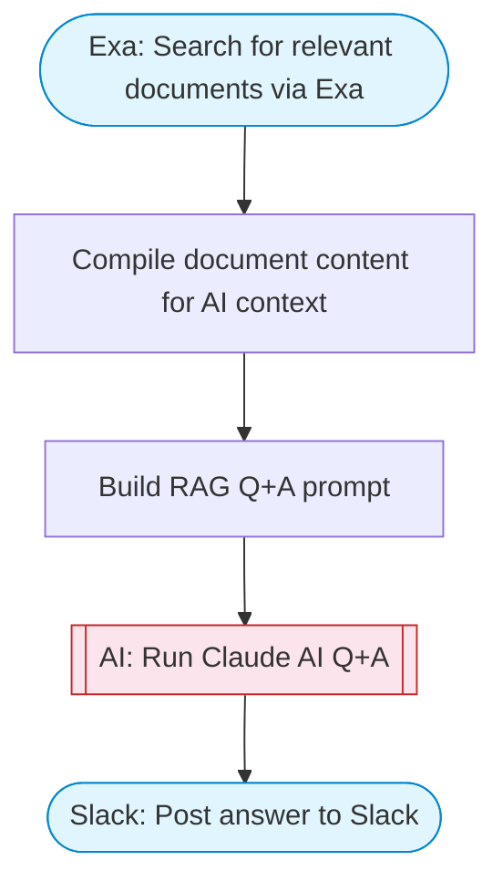

# Ask questions about a PDF using AI

RAG-style Q&A pipeline: searches Google Drive for documents, retrieves their content, uses Claude AI to answer questions based on the document content, and posts the answer to Slack with Block Kit formatting.

> **Works with any AI agent.** Paste this page's URL into Claude Code, Codex, Cursor, Windsurf, OpenClaw, or any coding agent — it will read the docs, connect your platforms, and run this flow for you.

## Quick Start

```bash
# 1. Connect your platforms (one-time setup)
one add google-sheets
one add slack
one add exa

# 2. Run the flow
one flow execute n8n-1960-ask-questions-about \
  --input question="your question here" \
  --input searchTopic="your topic here" \
  --input slackChannel="C01ABC123"
```

## Platforms

| Platform | Used for |
|----------|----------|
| Google Sheets | Connection key (used to access google drive files) |
| Slack | Post answer to Slack |
| Exa | Search for relevant documents via Exa |

> Don't have these connected yet? Run `one list` to check, then `one add <platform>` to connect.

## What it does

1. Search for relevant documents via Exa
2. Compile document content for AI context
3. Build RAG Q&A prompt
4. Run Claude AI Q&A
5. Post answer to Slack

## Flow diagram



## Inputs

| Input | Required | Description |
|-------|----------|-------------|
| `question` | Yes | The question you want answered based on document content |
| `searchTopic` | Yes | Topic to search for relevant documents (e.g. 'bitcoin whitepaper', 'quarterly report 2024') |
| `slackChannel` | Yes | Slack channel ID to post the answer |

---

<sub>Based on [n8n #1960](https://n8n.io/workflows/1960) · 142.8K views on n8n · by [davidn8n](https://n8n.io/creators/davidn8n) · Converted to One CLI on 2026-03-24</sub>
