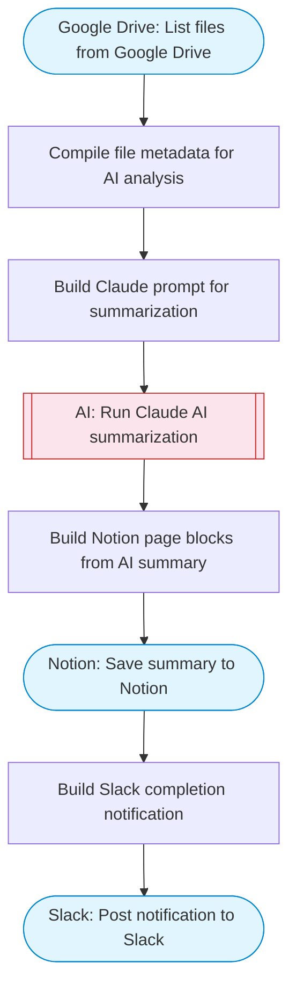

# Google Drive Document Summarizer to Notion

Lists files from Google Drive, uses Claude AI to summarize document contents, and saves structured summaries to Notion with properly chunked blocks (max 1900 chars). Posts a completion notification to Slack.

> **Works with any AI agent.** Paste this page's URL into Claude Code, Codex, Cursor, Windsurf, OpenClaw, or any coding agent — it will read the docs, connect your platforms, and run this flow for you.

## Quick Start

```bash
# 1. Connect your platforms (one-time setup)
one add google-drive
one add notion
one add slack

# 2. Run the flow
one flow execute n8n-2178-audio-doc-summarizer \
  --input slackChannel="C01ABC123" \
  --input notionParentPageId="..." \
  --input driveFolderId="..." \
  --input fileTypes="..."
```

## Platforms

| Platform | Used for |
|----------|----------|
| Google Drive | Listing files |
| Notion | Saving summaries |
| Slack | Completion notification |

> Don't have these connected yet? Run `one list` to check, then `one add <platform>` to connect.

## What it does

1. List files from Google Drive
2. Compile file metadata for AI analysis
3. Build Claude prompt for summarization
4. Run Claude AI summarization
5. Build Notion page blocks from AI summary
6. Save summary to Notion
7. Build Slack completion notification
8. Post notification to Slack

## Flow diagram



## Inputs

| Input | Required | Description |
|-------|----------|-------------|
| `slackChannel` | Yes | Slack channel for status updates |
| `notionParentPageId` | Yes | Notion parent page ID where summaries will be saved |
| `driveFolderId` | No | Google Drive folder ID to list files from (default: root) (default: root) |
| `fileTypes` | No | Types of files to summarize (e.g. 'documents and spreadsheets', 'PDFs', 'all files') (default: documents and spreadsheets) |

---

<sub>Based on [n8n #2178](https://n8n.io/workflows/2178) · 67.8K views on n8n · by [checkso](https://n8n.io/creators/checkso) · Converted to One CLI on 2026-03-25</sub>
