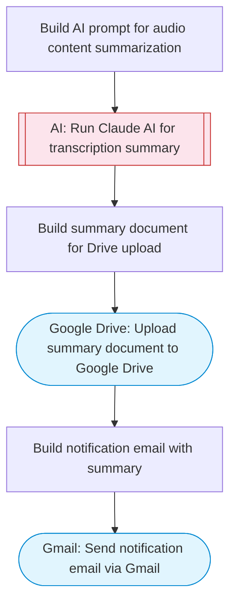

# Audio transcription and AI summary to Google Drive

Lists audio attachments from Gmail, uses Claude AI to generate transcription notes and summaries, saves structured summaries to Google Drive, and sends a notification email with the results.

> **Works with any AI agent.** Paste this page's URL into Claude Code, Codex, Cursor, Windsurf, OpenClaw, or any coding agent — it will read the docs, connect your platforms, and run this flow for you.

## Quick Start

```bash
# 1. Connect your platforms (one-time setup)
one add gmail
one add gmail
one add google-drive

# 2. Run the flow
one flow execute n8n-3076-audio-transcribe-summarize \
  --input driveFolderId="..." \
  --input notificationEmail="user@example.com" \
  --input audioDescription="..."
```

## Platforms

| Platform | Used for |
|----------|----------|
| Gmail | Listing emails with audio attachments |
| Gmail | Sending notification emails |
| Google Drive | Saving transcription summaries |

> Don't have these connected yet? Run `one list` to check, then `one add <platform>` to connect.

## What it does

1. Build AI prompt for audio content summarization
2. Run Claude AI for transcription summary
3. Build summary document for Drive upload
4. Upload summary document to Google Drive
5. Build notification email with summary
6. Send notification email via Gmail

## Flow diagram



## Inputs

| Input | Required | Description |
|-------|----------|-------------|
| `driveFolderId` | Yes | Google Drive folder ID to save transcription documents |
| `notificationEmail` | Yes | Email address to notify when transcription is complete |
| `audioDescription` | Yes | Description of the audio content to summarize (e.g. meeting notes, interview transcript, voice memo text) |

---

<sub>Based on [n8n #3076](https://n8n.io/workflows/3076) · 23.5K views on n8n · by [joe](https://n8n.io/creators/joe) · Converted to One CLI on 2026-03-25</sub>
