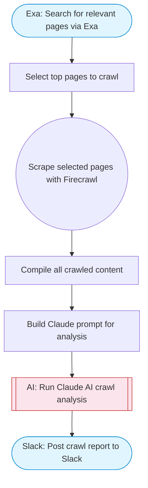

# Autonomous AI Crawler

Uses Exa to search for pages matching a query, Firecrawl to scrape multiple pages for deep content, Claude AI to analyze and extract structured data, and posts a comprehensive report to Slack with Block Kit formatting.

> **Works with any AI agent.** Paste this page's URL into Claude Code, Codex, Cursor, Windsurf, OpenClaw, or any coding agent — it will read the docs, connect your platforms, and run this flow for you.

## Quick Start

```bash
# 1. Connect your platforms (one-time setup)
one add exa
one add firecrawl
one add slack

# 2. Run the flow
one flow execute n8n-2315-autonomous-ai-crawler \
  --input slackChannel="C01ABC123" \
  --input searchQuery="your question here" \
  --input extractionGoal="..." \
  --input maxPages="10"
```

## Platforms

| Platform | Used for |
|----------|----------|
| Exa | Web search |
| Firecrawl | Scraping pages |
| Slack | Posting results |

> Don't have these connected yet? Run `one list` to check, then `one add <platform>` to connect.

## What it does

1. Search for relevant pages via Exa
2. Select top pages to crawl
3. Scrape selected pages with Firecrawl
4. Compile all crawled content
5. Build Claude prompt for analysis
6. Run Claude AI crawl analysis
7. Post crawl report to Slack

## Flow diagram



## Inputs

| Input | Required | Description |
|-------|----------|-------------|
| `slackChannel` | Yes | Slack channel to post the crawl report |
| `searchQuery` | Yes | What to search for (e.g. 'social media profiles for tech companies') |
| `extractionGoal` | No | What specific data to extract from crawled pages (default: Extract all relevant structured data, contacts, links, and key information) |
| `maxPages` | No | Maximum number of pages to crawl (1-10) (default: 5) |

---

<sub>Based on [n8n #2315](https://n8n.io/workflows/2315) · 74.3K views on n8n · by [workfloows](https://n8n.io/creators/workfloows) · Converted to One CLI on 2026-03-25</sub>
