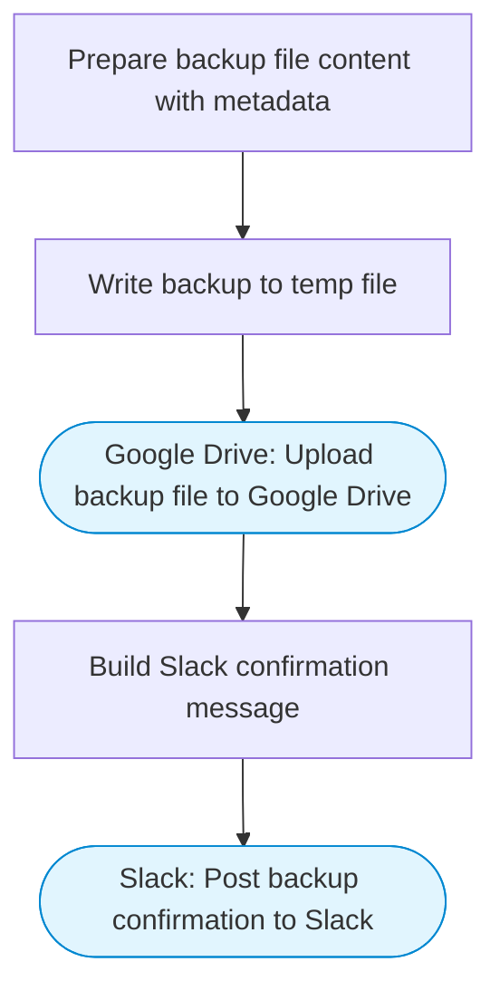

# Backup workflow configs to Google Drive

Exports workflow configurations and settings as a JSON backup file, uploads it to a designated Google Drive folder, and posts a backup confirmation to Slack.

> **Works with any AI agent.** Paste this page's URL into Claude Code, Codex, Cursor, Windsurf, OpenClaw, or any coding agent — it will read the docs, connect your platforms, and run this flow for you.

## Quick Start

```bash
# 1. Connect your platforms (one-time setup)
one add google-drive
one add slack

# 2. Run the flow
one flow execute n8n-1150-backup-workflows-drive \
  --input slackChannel="C01ABC123" \
  --input backupFolderId="..." \
  --input backupData="..." \
  --input backupLabel="..."
```

## Platforms

| Platform | Used for |
|----------|----------|
| Google Drive | Uploading backup files |
| Slack | Posting backup confirmation |

> Don't have these connected yet? Run `one list` to check, then `one add <platform>` to connect.

## What it does

1. Prepare backup file content with metadata
2. Write backup to temp file
3. Upload backup file to Google Drive
4. Build Slack confirmation message
5. Post backup confirmation to Slack

## Flow diagram



## Inputs

| Input | Required | Description |
|-------|----------|-------------|
| `slackChannel` | Yes | Slack channel ID for backup notifications |
| `backupFolderId` | Yes | Google Drive folder ID where backups should be stored |
| `backupData` | Yes | JSON string of workflow configurations to backup |
| `backupLabel` | No | Label for the backup file (e.g. 'production-workflows') (default: workflow-backup) |

---

<sub>Based on [n8n #1150](https://n8n.io/workflows/1150) · 23.6K views on n8n · by [djangelic](https://n8n.io/creators/djangelic) · Converted to One CLI on 2026-03-25</sub>
