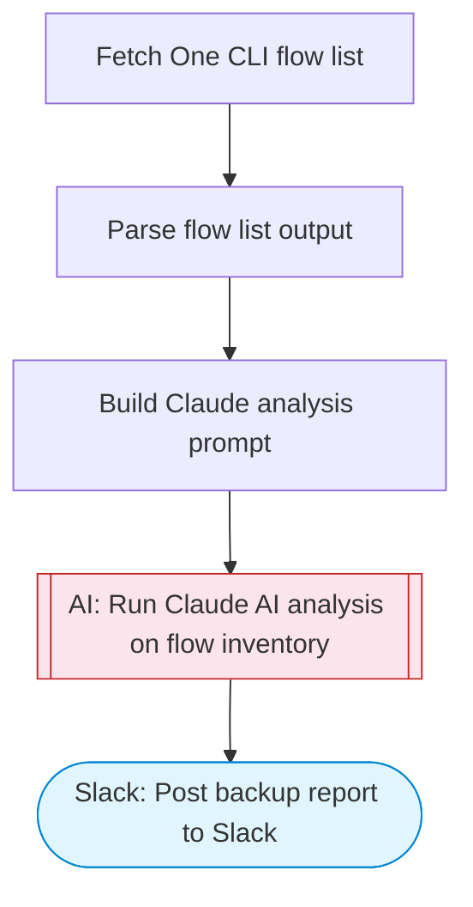

# Backup workflows to GitHub (adapted: flow list summary to Slack)

Fetches the current One CLI flow list, uses Claude AI to analyze and summarize the flow inventory, and posts a structured backup report to Slack using Block Kit formatting.

> **Works with any AI agent.** Paste this page's URL into Claude Code, Codex, Cursor, Windsurf, OpenClaw, or any coding agent — it will read the docs, connect your platforms, and run this flow for you.

## Quick Start

```bash
# 1. Connect your platforms (one-time setup)
one add slack

# 2. Run the flow
one flow execute n8n-2483-backup-workflows-github \
  --input slackChannel="C01ABC123" \
  --input flowDirectory="..."
```

## Platforms

| Platform | Used for |
|----------|----------|
| Slack | Post backup report to Slack |

> Don't have these connected yet? Run `one list` to check, then `one add <platform>` to connect.

## What it does

1. Fetch One CLI flow list
2. Parse flow list output
3. Build Claude analysis prompt
4. Run Claude AI analysis on flow inventory
5. Post backup report to Slack

## Flow diagram



## Inputs

| Input | Required | Description |
|-------|----------|-------------|
| `slackChannel` | Yes | Slack channel to post the backup summary |
| `flowDirectory` | No | Path to the One CLI flows directory (default: ~/.one/flows) |

---

<sub>Based on [n8n #2483](https://n8n.io/workflows/1534) · 100.6K views on n8n · Converted to One CLI on 2026-03-25</sub>
