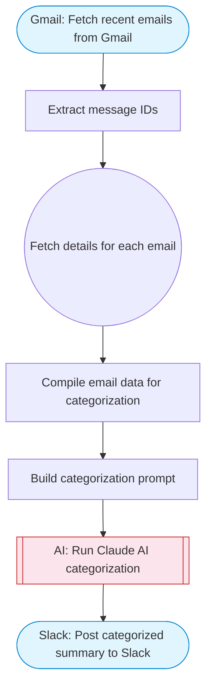

# Basic automatic Gmail email labelling with OpenAI and Gmail API

Gmail auto-categorizer: fetches recent emails from Gmail, uses Claude AI to categorize each by urgency and type, and posts a structured categorized summary to Slack using Block Kit formatting.

> **Works with any AI agent.** Paste this page's URL into Claude Code, Codex, Cursor, Windsurf, OpenClaw, or any coding agent — it will read the docs, connect your platforms, and run this flow for you.

## Quick Start

```bash
# 1. Connect your platforms (one-time setup)
one add gmail
one add slack

# 2. Run the flow
one flow execute n8n-2740-basic-automatic-gmail \
  --input maxEmails="user@example.com" \
  --input slackChannel="C01ABC123"
```

## Platforms

| Platform | Used for |
|----------|----------|
| Gmail | Fetch recent emails from Gmail |
| Slack | Post categorized summary to Slack |

> Don't have these connected yet? Run `one list` to check, then `one add <platform>` to connect.

## What it does

1. Fetch recent emails from Gmail
2. Extract message IDs
3. Fetch details for each email
4. Compile email data for categorization
5. Build categorization prompt
6. Run Claude AI categorization
7. Post categorized summary to Slack

## Flow diagram



## Inputs

| Input | Required | Description |
|-------|----------|-------------|
| `maxEmails` | No | Maximum number of recent emails to categorize (default: 10) (default: 10) |
| `slackChannel` | Yes | Slack channel ID to post the categorized summary |

---

<sub>Based on [n8n #2740](https://n8n.io/workflows/2740) · 127.9K views on n8n · by [mkc](https://n8n.io/creators/mkc) · Converted to One CLI on 2026-03-24</sub>
