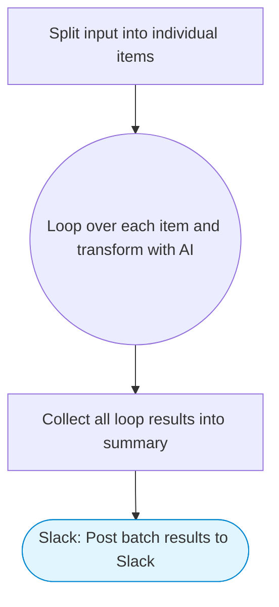

# Batch Processor — Loop, Transform & Collect to Slack

Takes a comma-separated list of items, loops over each one, uses Claude AI to transform/enrich each item, collects all results, and posts a formatted summary to Slack.

> **Works with any AI agent.** Paste this page's URL into Claude Code, Codex, Cursor, Windsurf, OpenClaw, or any coding agent — it will read the docs, connect your platforms, and run this flow for you.

## Quick Start

```bash
# 1. Connect your platforms (one-time setup)
one add slack

# 2. Run the flow
one flow execute n8n-2896-batch-processor \
  --input slackChannel="C01ABC123" \
  --input items="..." \
  --input transformInstruction="..."
```

## Platforms

| Platform | Used for |
|----------|----------|
| Slack | Post batch results to Slack |

> Don't have these connected yet? Run `one list` to check, then `one add <platform>` to connect.

## What it does

1. Split input into individual items
2. Loop over each item and transform with AI
3. Collect all loop results into summary
4. Post batch results to Slack

## Flow diagram



## Inputs

| Input | Required | Description |
|-------|----------|-------------|
| `slackChannel` | Yes | Slack channel ID to post results |
| `items` | Yes | Comma-separated list of items to process (e.g. 'Apple, Google, Microsoft') |
| `transformInstruction` | No | What Claude should do with each item (default: Provide a one-sentence summary of what this company does and its main product.) |

---

<sub>Based on [n8n #2896](https://n8n.io/workflows/2896) · 45.0K views on n8n · by [dom](https://n8n.io/creators/dom) · Converted to One CLI on 2026-03-25</sub>
