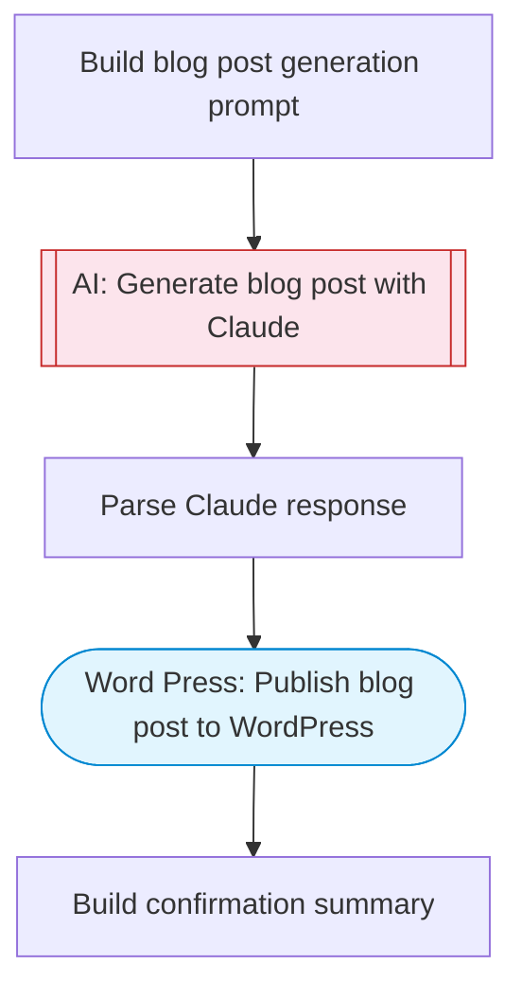

# AI Blog Automation for WordPress

Generate SEO-optimized blog posts with Claude AI and publish them directly to WordPress. Provide a topic and keywords, and the AI writes a complete blog post with title, meta description, and structured content.

> **Works with any AI agent.** Paste this page's URL into Claude Code, Codex, Cursor, Windsurf, OpenClaw, or any coding agent — it will read the docs, connect your platforms, and run this flow for you.

## Quick Start

```bash
# 1. Connect your platforms (one-time setup)
one add word-press

# 2. Run the flow
one flow execute n8n-5230-blog-automation-wordpress \
  --input wordpressSite="..." \
  --input topic="your topic here" \
  --input keywords="..." \
  --input tone="..." \
  --input wordCount="..." \
  --input publishStatus="..."
```

## Platforms

| Platform | Used for |
|----------|----------|
| Word Press | Publish blog post to WordPress |

> Don't have these connected yet? Run `one list` to check, then `one add <platform>` to connect.

## What it does

1. Build blog post generation prompt
2. Generate blog post with Claude
3. Parse Claude response
4. Publish blog post to WordPress
5. Build confirmation summary

## Flow diagram



## Inputs

| Input | Required | Description |
|-------|----------|-------------|
| `wordpressSite` | Yes | WordPress site domain (e.g. 'mysite.wordpress.com' or site ID) |
| `topic` | Yes | Blog post topic (e.g. '10 Best Practices for Remote Work in 2026') |
| `keywords` | No | Comma-separated SEO keywords to target (default: ) |
| `tone` | No | Writing tone (e.g. 'conversational', 'professional', 'informative and engaging') (default: informative and engaging) |
| `wordCount` | No | Target word count for the blog post (default: 1500) |
| `publishStatus` | No | Post status: 'draft' or 'publish' (default: draft) |

---

<sub>Based on [n8n #5230](https://n8n.io/workflows/5230) · 33.2K views on n8n · by [jay-emp0](https://n8n.io/creators/jay-emp0) · Converted to One CLI on 2026-03-25</sub>
