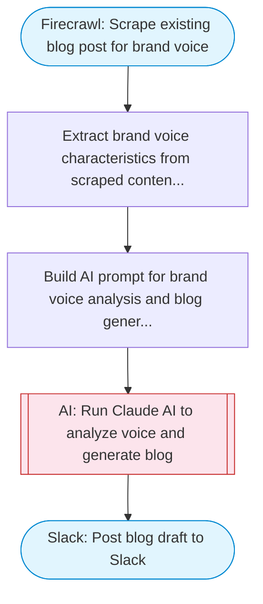

# Blog creator in brand voice using AI

Scrapes existing blog posts from a website to learn brand voice, then uses Claude AI to generate a new blog post matching that style, and posts the result to Slack.

> **Works with any AI agent.** Paste this page's URL into Claude Code, Codex, Cursor, Windsurf, OpenClaw, or any coding agent — it will read the docs, connect your platforms, and run this flow for you.

## Quick Start

```bash
# 1. Connect your platforms (one-time setup)
one add firecrawl
one add slack

# 2. Run the flow
one flow execute n8n-2648-blog-brand-voice-ai \
  --input slackChannel="C01ABC123" \
  --input blogUrl="https://example.com" \
  --input blogTopic="your topic here" \
  --input targetAudience="..."
```

## Platforms

| Platform | Used for |
|----------|----------|
| Firecrawl | Scraping existing blog posts |
| Slack | Posting the generated blog |

> Don't have these connected yet? Run `one list` to check, then `one add <platform>` to connect.

## What it does

1. Scrape existing blog post for brand voice
2. Extract brand voice characteristics from scraped content
3. Build AI prompt for brand voice analysis and blog generation
4. Run Claude AI to analyze voice and generate blog
5. Post blog draft to Slack

## Flow diagram



## Inputs

| Input | Required | Description |
|-------|----------|-------------|
| `slackChannel` | Yes | Slack channel ID to post the generated blog draft |
| `blogUrl` | Yes | URL of an existing blog post to learn brand voice from (e.g. 'https://company.com/blog/sample-post') |
| `blogTopic` | Yes | Topic for the new blog post to generate (e.g. 'How AI is transforming customer support') |
| `targetAudience` | No | Target audience for the blog post (default: general business audience) |

---

<sub>Based on [n8n #2648](https://n8n.io/workflows/2648) · 26.3K views on n8n · by [jimleuk](https://n8n.io/creators/jimleuk) · Converted to One CLI on 2026-03-25</sub>
