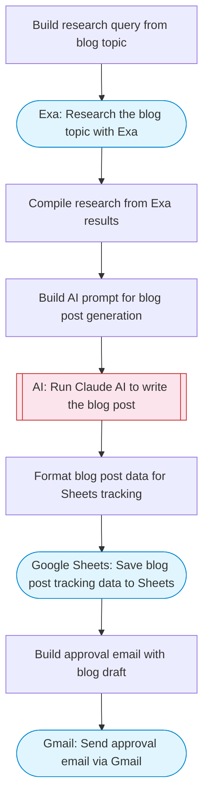

# Blog content creator with Sheets tracking and email approval

Reads blog topic ideas from Google Sheets, uses Claude AI to research and write SEO-optimized blog posts, saves drafts back to Sheets, and sends an approval request email via Gmail.

> **Works with any AI agent.** Paste this page's URL into Claude Code, Codex, Cursor, Windsurf, OpenClaw, or any coding agent — it will read the docs, connect your platforms, and run this flow for you.

## Quick Start

```bash
# 1. Connect your platforms (one-time setup)
one add google-sheets
one add gmail
one add exa

# 2. Run the flow
one flow execute n8n-4371-blog-content-approval \
  --input approverEmail="user@example.com" \
  --input blogTopic="your topic here" \
  --input targetKeyword="..." \
  --input wordCount="..."
```

## Platforms

| Platform | Used for |
|----------|----------|
| Google Sheets | Reading topics and saving drafts |
| Gmail | Sending approval emails |
| Exa | Researching blog topics |

> Don't have these connected yet? Run `one list` to check, then `one add <platform>` to connect.

## What it does

1. Build research query from blog topic
2. Research the blog topic with Exa
3. Compile research from Exa results
4. Build AI prompt for blog post generation
5. Run Claude AI to write the blog post
6. Format blog post data for Sheets tracking
7. Save blog post tracking data to Sheets
8. Build approval email with blog draft
9. Send approval email via Gmail

## Flow diagram



## Inputs

| Input | Required | Description |
|-------|----------|-------------|
| `approverEmail` | Yes | Email address of the person who approves blog posts |
| `blogTopic` | Yes | Blog topic or title to write about (e.g. 'How to improve team productivity with AI') |
| `targetKeyword` | No | Primary SEO keyword to target (optional) (default: ) |
| `wordCount` | No | Target word count for the blog post (default: 1500) |

---

<sub>Based on [n8n #4371](https://n8n.io/workflows/4371) · 24.3K views on n8n · by [billy](https://n8n.io/creators/billy) · Converted to One CLI on 2026-03-25</sub>
