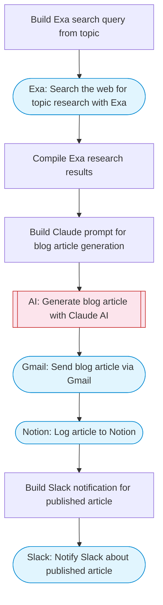

# Automate blog content creation with AI, Exa research, Gmail and Slack

Researches a topic using Exa web search, generates an SEO-optimized blog article with Claude AI, sends the article via Gmail, notifies a Slack channel, and logs the content in a Notion database page.

> **Works with any AI agent.** Paste this page's URL into Claude Code, Codex, Cursor, Windsurf, OpenClaw, or any coding agent — it will read the docs, connect your platforms, and run this flow for you.

## Quick Start

```bash
# 1. Connect your platforms (one-time setup)
one add exa
one add gmail
one add slack
one add notion

# 2. Run the flow
one flow execute n8n-3336-blog-content-creation \
  --input topic="your topic here" \
  --input recipientEmail="user@example.com" \
  --input slackChannel="C01ABC123" \
  --input notionParentPageId="..."
```

## Platforms

| Platform | Used for |
|----------|----------|
| Exa | Web research |
| Gmail | Sending the article |
| Slack | Notifications |
| Notion | Logging articles |

> Don't have these connected yet? Run `one list` to check, then `one add <platform>` to connect.

## What it does

1. Build Exa search query from topic
2. Search the web for topic research with Exa
3. Compile Exa research results
4. Build Claude prompt for blog article generation
5. Generate blog article with Claude AI
6. Send blog article via Gmail
7. Log article to Notion
8. Notify Slack about published article

## Flow diagram



## Inputs

| Input | Required | Description |
|-------|----------|-------------|
| `topic` | Yes | Blog topic or research query (e.g. 'AI automation trends 2026') |
| `recipientEmail` | Yes | Email address to send the finished article to |
| `slackChannel` | Yes | Slack channel for publish notifications |
| `notionParentPageId` | Yes | Notion parent page ID to store the article under |

---

<sub>Based on [n8n #3336](https://n8n.io/workflows/3336) · 28.8K views on n8n · by [drfiras](https://n8n.io/creators/drfiras) · Converted to One CLI on 2026-03-25</sub>
