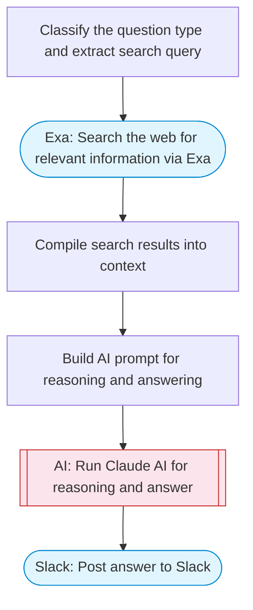

# Build your first AI agent

A beginner-friendly AI agent that demonstrates tool use: takes a question, searches the web for real-time information via Exa, uses Claude for reasoning and calculations, and posts a helpful answer to Slack with Block Kit formatting.

> **Works with any AI agent.** Paste this page's URL into Claude Code, Codex, Cursor, Windsurf, OpenClaw, or any coding agent — it will read the docs, connect your platforms, and run this flow for you.

## Quick Start

```bash
# 1. Connect your platforms (one-time setup)
one add exa
one add slack

# 2. Run the flow
one flow execute n8n-6270-build-first-agent \
  --input question="your question here" \
  --input slackChannel="C01ABC123"
```

## Platforms

| Platform | Used for |
|----------|----------|
| Exa | Web search |
| Slack | Posting results |

> Don't have these connected yet? Run `one list` to check, then `one add <platform>` to connect.

## What it does

1. Classify the question type and extract search query
2. Search the web for relevant information via Exa
3. Compile search results into context
4. Build AI prompt for reasoning and answering
5. Run Claude AI for reasoning and answer
6. Post answer to Slack

## Flow diagram



## Inputs

| Input | Required | Description |
|-------|----------|-------------|
| `question` | Yes | The user's question — can involve facts, calculations, or current events |
| `slackChannel` | Yes | Slack channel ID to post the answer |

---

<sub>Based on [n8n #6270](https://n8n.io/workflows/6270) · 801.9K views on n8n · by [lucaspeyrin](https://n8n.io/creators/lucaspeyrin) · Converted to One CLI on 2026-03-24</sub>
