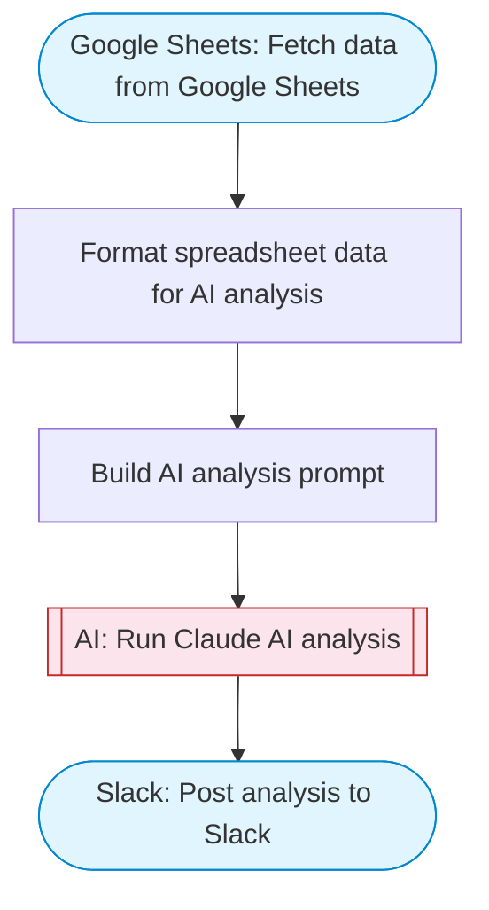

# Build your first AI data analyst chatbot

AI data analyst chatbot: takes a question about your data, fetches transactions from Google Sheets, uses Claude to analyze patterns and generate insights, then posts a formatted analysis to Slack with Block Kit.

> **Works with any AI agent.** Paste this page's URL into Claude Code, Codex, Cursor, Windsurf, OpenClaw, or any coding agent — it will read the docs, connect your platforms, and run this flow for you.

## Quick Start

```bash
# 1. Connect your platforms (one-time setup)
one add google-sheets
one add slack

# 2. Run the flow
one flow execute n8n-3050-build-first-data \
  --input spreadsheetId="..." \
  --input sheetRange="..." \
  --input question="your question here" \
  --input slackChannel="C01ABC123"
```

## Platforms

| Platform | Used for |
|----------|----------|
| Google Sheets | Fetch data from Google Sheets |
| Slack | Post analysis to Slack |

> Don't have these connected yet? Run `one list` to check, then `one add <platform>` to connect.

## What it does

1. Fetch data from Google Sheets
2. Format spreadsheet data for AI analysis
3. Build AI analysis prompt
4. Run Claude AI analysis
5. Post analysis to Slack

## Flow diagram



## Inputs

| Input | Required | Description |
|-------|----------|-------------|
| `spreadsheetId` | Yes | Google Sheets spreadsheet ID containing your data |
| `sheetRange` | No | Range to read (default: Sheet1!A:Z) (default: Sheet1!A:Z) |
| `question` | Yes | Your data analysis question (e.g. 'What are the top 5 products by revenue?') |
| `slackChannel` | Yes | Slack channel ID to post the analysis |

---

<sub>Based on [n8n #3050](https://n8n.io/workflows/3050) · 169.2K views on n8n · by [solomon](https://n8n.io/creators/solomon) · Converted to One CLI on 2026-03-24</sub>
