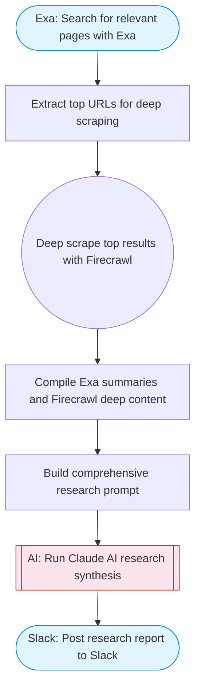

# Multi-tool research chain (Exa + Firecrawl + Claude)

Chains multiple tools together: Exa searches for relevant pages, Firecrawl scrapes the top results for detailed content, and Claude AI synthesizes everything into a comprehensive research report. Posts results to Slack.

> **Works with any AI agent.** Paste this page's URL into Claude Code, Codex, Cursor, Windsurf, OpenClaw, or any coding agent — it will read the docs, connect your platforms, and run this flow for you.

## Quick Start

```bash
# 1. Connect your platforms (one-time setup)
one add exa
one add firecrawl
one add slack

# 2. Run the flow
one flow execute n8n-7788-build-mcp-server \
  --input slackChannel="C01ABC123" \
  --input researchQuery="your question here" \
  --input scrapeTopN="..."
```

## Platforms

| Platform | Used for |
|----------|----------|
| Exa | Web search |
| Firecrawl | Web scraping |
| Slack | Post research report to Slack |

> Don't have these connected yet? Run `one list` to check, then `one add <platform>` to connect.

## What it does

1. Search for relevant pages with Exa
2. Extract top URLs for deep scraping
3. Deep scrape top results with Firecrawl
4. Compile Exa summaries and Firecrawl deep content
5. Build comprehensive research prompt
6. Run Claude AI research synthesis
7. Post research report to Slack

## Flow diagram



## Inputs

| Input | Required | Description |
|-------|----------|-------------|
| `slackChannel` | Yes | Slack channel to post the research report |
| `researchQuery` | Yes | The topic or question to research |
| `scrapeTopN` | No | Number of top Exa results to deep-scrape with Firecrawl (default: 3) |

---

<sub>Based on [n8n #7788](https://n8n.io/workflows/3770) · 91.4K views on n8n · by [pomegai](https://n8n.io/creators/pomegai) · Converted to One CLI on 2026-03-25</sub>
