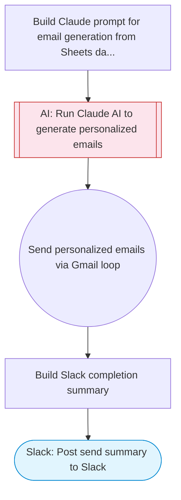

# Bulk email from Sheets: read recipients, send personalized Gmail

Reads recipient data from a Google Sheets spreadsheet, uses Claude AI to generate personalized email content for each recipient, sends individual emails via Gmail in a loop, and posts a completion summary to Slack.

> **Works with any AI agent.** Paste this page's URL into Claude Code, Codex, Cursor, Windsurf, OpenClaw, or any coding agent — it will read the docs, connect your platforms, and run this flow for you.

## Quick Start

```bash
# 1. Connect your platforms (one-time setup)
one add gmail
one add google-sheets
one add slack

# 2. Run the flow
one flow execute n8n-2088-bulk-gmail-sheets \
  --input slackChannel="C01ABC123" \
  --input spreadsheetUrl="https://example.com" \
  --input sheetName="..." \
  --input emailTemplate="user@example.com" \
  --input senderName="Alex"
```

## Platforms

| Platform | Used for |
|----------|----------|
| Gmail | Sending emails |
| Google Sheets | Reading recipients |
| Slack | Status notification |

> Don't have these connected yet? Run `one list` to check, then `one add <platform>` to connect.

## What it does

1. Build Claude prompt for email generation from Sheets data
2. Run Claude AI to generate personalized emails
3. Send personalized emails via Gmail loop
4. Build Slack completion summary
5. Post send summary to Slack

## Flow diagram



## Inputs

| Input | Required | Description |
|-------|----------|-------------|
| `slackChannel` | Yes | Slack channel for send status notification |
| `spreadsheetUrl` | Yes | Google Sheets URL with recipient data (expected columns: Name, Email, Subject, Message or template fields) |
| `sheetName` | No | Sheet tab name containing recipient data (default: Sheet1) |
| `emailTemplate` | Yes | Email template or purpose description. Use {name}, {company} as placeholders, or describe what the email should say. |
| `senderName` | No | Name for the email signature (default: Sender) |

---

<sub>Based on [n8n #2088](https://n8n.io/workflows/2088) · 53.2K views on n8n · by [omar](https://n8n.io/creators/omar) · Converted to One CLI on 2026-03-25</sub>
