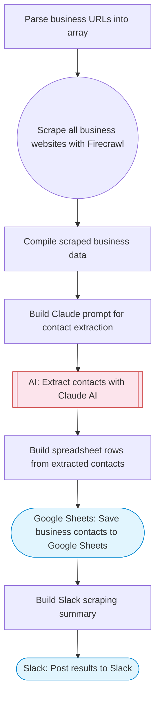

# Business scraper with contact extraction via Firecrawl and Google Sheets

Takes a list of business website URLs, scrapes each with Firecrawl, uses Claude AI to extract contact information (emails, phones, social profiles), saves all business data and contacts to Google Sheets, and posts a summary to Slack.

> **Works with any AI agent.** Paste this page's URL into Claude Code, Codex, Cursor, Windsurf, OpenClaw, or any coding agent — it will read the docs, connect your platforms, and run this flow for you.

## Quick Start

```bash
# 1. Connect your platforms (one-time setup)
one add firecrawl
one add google-sheets
one add slack

# 2. Run the flow
one flow execute n8n-4573-business-scraper \
  --input businessUrls="https://example.com" \
  --input slackChannel="C01ABC123" \
  --input industry="B2B SaaS"
```

## Platforms

| Platform | Used for |
|----------|----------|
| Firecrawl | Scraping business websites |
| Google Sheets | Saving data |
| Slack | Notifications |

> Don't have these connected yet? Run `one list` to check, then `one add <platform>` to connect.

## What it does

1. Parse business URLs into array
2. Scrape all business websites with Firecrawl
3. Compile scraped business data
4. Build Claude prompt for contact extraction
5. Extract contacts with Claude AI
6. Build spreadsheet rows from extracted contacts
7. Save business contacts to Google Sheets
8. Build Slack scraping summary
9. Post results to Slack

## Flow diagram



## Inputs

| Input | Required | Description |
|-------|----------|-------------|
| `businessUrls` | Yes | Comma-separated list of business website URLs to scrape |
| `slackChannel` | Yes | Slack channel for scraping results |
| `industry` | No | Industry context for better extraction (e.g. 'restaurants', 'SaaS') (default: ) |

---

<sub>Based on [n8n #4573](https://n8n.io/workflows/4573) · 27.7K views on n8n · by [n8nstein](https://n8n.io/creators/n8nstein) · Converted to One CLI on 2026-03-25</sub>
