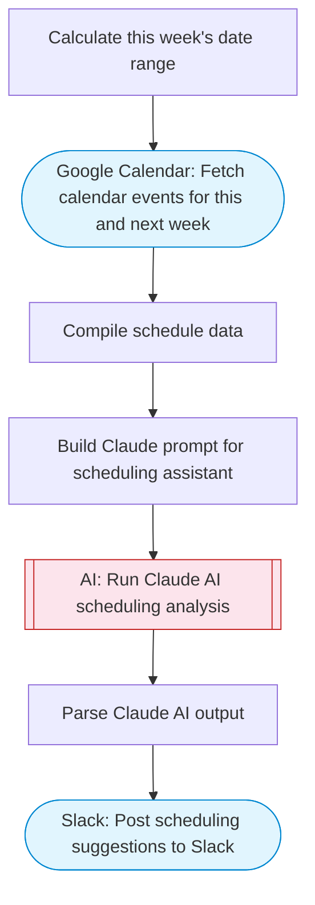

# Calendar AI Scheduling Assistant

Fetches Google Calendar events, uses Claude AI to help with scheduling decisions, suggests meeting preparation tasks, identifies optimal time slots, and posts actionable recommendations to Slack with Block Kit formatting.

> **Works with any AI agent.** Paste this page's URL into Claude Code, Codex, Cursor, Windsurf, OpenClaw, or any coding agent — it will read the docs, connect your platforms, and run this flow for you.

## Quick Start

```bash
# 1. Connect your platforms (one-time setup)
one add google-calendar
one add slack

# 2. Run the flow
one flow execute n8n-2703-calendar-ai-assistant \
  --input slackChannel="C01ABC123" \
  --input schedulingRequest="..." \
  --input workHoursStart="..." \
  --input workHoursEnd="..."
```

## Platforms

| Platform | Used for |
|----------|----------|
| Google Calendar | Connection key |
| Slack | Posting suggestions |

> Don't have these connected yet? Run `one list` to check, then `one add <platform>` to connect.

## What it does

1. Calculate this week's date range
2. Fetch calendar events for this and next week
3. Compile schedule data
4. Build Claude prompt for scheduling assistant
5. Run Claude AI scheduling analysis
6. Parse Claude AI output
7. Post scheduling suggestions to Slack

## Flow diagram



## Inputs

| Input | Required | Description |
|-------|----------|-------------|
| `slackChannel` | Yes | Slack channel to post scheduling suggestions |
| `schedulingRequest` | No | Optional scheduling request (e.g. 'Find time for a 1-hour team sync this week') (default: ) |
| `workHoursStart` | No | Work day start hour (default: 9) (default: 9) |
| `workHoursEnd` | No | Work day end hour (default: 17) (default: 17) |

---

<sub>Based on [n8n #2703](https://n8n.io/workflows/2703) · 68.8K views on n8n · by [dataki](https://n8n.io/creators/dataki) · Converted to One CLI on 2026-03-25</sub>
