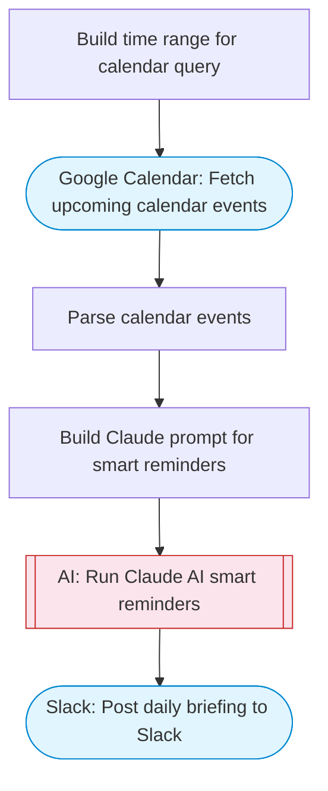

# Google Calendar reminder system with AI and Slack

Fetches upcoming Google Calendar events, uses Claude AI to prioritize and format reminders with context and preparation tips, then posts a structured daily briefing to Slack. Adapted from n8n's Google Calendar reminder system with GPT-4o workflow.

> **Works with any AI agent.** Paste this page's URL into Claude Code, Codex, Cursor, Windsurf, OpenClaw, or any coding agent — it will read the docs, connect your platforms, and run this flow for you.

## Quick Start

```bash
# 1. Connect your platforms (one-time setup)
one add google-calendar
one add slack

# 2. Run the flow
one flow execute n8n-3393-calendar-reminder-slack \
  --input slackChannel="C01ABC123" \
  --input calendarId="..." \
  --input hoursAhead="..."
```

## Platforms

| Platform | Used for |
|----------|----------|
| Google Calendar | Connection key |
| Slack | Reminders |

> Don't have these connected yet? Run `one list` to check, then `one add <platform>` to connect.

## What it does

1. Build time range for calendar query
2. Fetch upcoming calendar events
3. Parse calendar events
4. Build Claude prompt for smart reminders
5. Run Claude AI smart reminders
6. Post daily briefing to Slack

## Flow diagram



## Inputs

| Input | Required | Description |
|-------|----------|-------------|
| `slackChannel` | Yes | Slack channel ID for calendar reminders |
| `calendarId` | No | Google Calendar ID (default: primary) (default: primary) |
| `hoursAhead` | No | How many hours ahead to look for events (default: 24) |

---

<sub>Based on [n8n #3393](https://n8n.io/workflows/3393) · 28.9K views on n8n · by [n3witalia](https://n8n.io/creators/n3witalia) · Converted to One CLI on 2026-03-25</sub>
