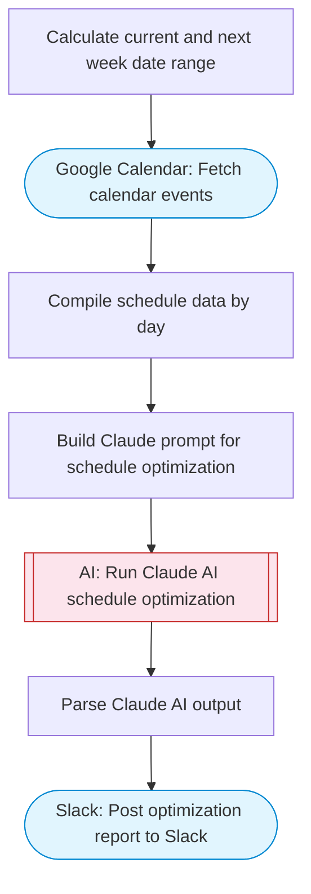

# Calendar Schedule Optimizer

Lists Google Calendar events for the current week, uses Claude AI to analyze the schedule and suggest optimizations including time-blocking, conflict resolution, and productivity improvements, then posts actionable recommendations to Slack with Block Kit formatting.

> **Works with any AI agent.** Paste this page's URL into Claude Code, Codex, Cursor, Windsurf, OpenClaw, or any coding agent — it will read the docs, connect your platforms, and run this flow for you.

## Quick Start

```bash
# 1. Connect your platforms (one-time setup)
one add google-calendar
one add slack

# 2. Run the flow
one flow execute n8n-3514-calendar-schedule-optimizer \
  --input slackChannel="C01ABC123" \
  --input optimizationFocus="..." \
  --input workHoursStart="..." \
  --input workHoursEnd="..."
```

## Platforms

| Platform | Used for |
|----------|----------|
| Google Calendar | Connection key |
| Slack | Posting schedule analysis |

> Don't have these connected yet? Run `one list` to check, then `one add <platform>` to connect.

## What it does

1. Calculate current and next week date range
2. Fetch calendar events
3. Compile schedule data by day
4. Build Claude prompt for schedule optimization
5. Run Claude AI schedule optimization
6. Parse Claude AI output
7. Post optimization report to Slack

## Flow diagram



## Inputs

| Input | Required | Description |
|-------|----------|-------------|
| `slackChannel` | Yes | Slack channel to post schedule optimization |
| `optimizationFocus` | No | Optional focus area (e.g. 'reduce meetings', 'find focus time', 'balance workload') (default: ) |
| `workHoursStart` | No | Work day start hour (default: 9) (default: 9) |
| `workHoursEnd` | No | Work day end hour (default: 17) (default: 17) |

---

<sub>Based on [n8n #3514](https://n8n.io/workflows/3514) · 71.8K views on n8n · by [solomon](https://n8n.io/creators/solomon) · Converted to One CLI on 2026-03-25</sub>
