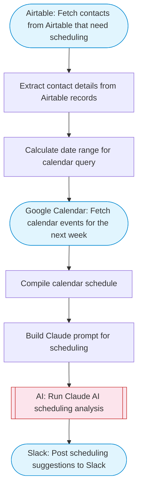

# AI Call Scheduler

Checks Airtable for contacts that need calls scheduled, fetches Google Calendar availability, uses Claude AI to suggest optimal meeting times considering schedules and preferences, and posts the scheduling suggestions to Slack. Adapted from n8n's voice AI receptionist call scheduling workflow.

> **Works with any AI agent.** Paste this page's URL into Claude Code, Codex, Cursor, Windsurf, OpenClaw, or any coding agent — it will read the docs, connect your platforms, and run this flow for you.

## Quick Start

```bash
# 1. Connect your platforms (one-time setup)
one add airtable
one add google-calendar
one add slack

# 2. Run the flow
one flow execute n8n-3427-call-scheduler \
  --input baseId="..." \
  --input tableName="..." \
  --input slackChannel="C01ABC123" \
  --input meetingDuration="..." \
  --input workHoursStart="..." \
  --input workHoursEnd="..."
```

## Platforms

| Platform | Used for |
|----------|----------|
| Airtable | Fetching contacts |
| Google Calendar | Checking availability |
| Slack | Posting suggestions |

> Don't have these connected yet? Run `one list` to check, then `one add <platform>` to connect.

## What it does

1. Fetch contacts from Airtable that need scheduling
2. Extract contact details from Airtable records
3. Calculate date range for calendar query
4. Fetch calendar events for the next week
5. Compile calendar schedule
6. Build Claude prompt for scheduling
7. Run Claude AI scheduling analysis
8. Post scheduling suggestions to Slack

## Flow diagram



## Inputs

| Input | Required | Description |
|-------|----------|-------------|
| `baseId` | Yes | Airtable base ID containing contacts |
| `tableName` | Yes | Airtable table name with contacts to schedule |
| `slackChannel` | Yes | Slack channel ID to post scheduling suggestions |
| `meetingDuration` | No | Default meeting duration in minutes (default: 30) (default: 30) |
| `workHoursStart` | No | Work day start hour (default: 9) (default: 9) |
| `workHoursEnd` | No | Work day end hour (default: 17) (default: 17) |

---

<sub>Based on [n8n #3427](https://n8n.io/workflows/3427) · 47.2K views on n8n · by [customaistudio](https://n8n.io/creators/customaistudio) · Converted to One CLI on 2026-03-25</sub>
