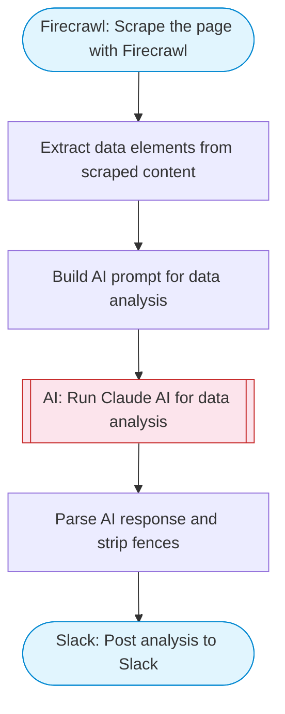

# Chart & Data Analyzer — Firecrawl Scrape + Claude AI to Slack

Scrapes a URL containing charts, tables, or data visualizations using Firecrawl, uses Claude AI to analyze the visual and data content, and posts a structured analysis to Slack.

> **Works with any AI agent.** Paste this page's URL into Claude Code, Codex, Cursor, Windsurf, OpenClaw, or any coding agent — it will read the docs, connect your platforms, and run this flow for you.

## Quick Start

```bash
# 1. Connect your platforms (one-time setup)
one add firecrawl
one add slack

# 2. Run the flow
one flow execute n8n-2642-chart-analyzer \
  --input slackChannel="C01ABC123" \
  --input pageUrl="https://example.com" \
  --input analysisGoal="..."
```

## Platforms

| Platform | Used for |
|----------|----------|
| Firecrawl | Scrape the page with Firecrawl |
| Slack | Post analysis to Slack |

> Don't have these connected yet? Run `one list` to check, then `one add <platform>` to connect.

## What it does

1. Scrape the page with Firecrawl
2. Extract data elements from scraped content
3. Build AI prompt for data analysis
4. Run Claude AI for data analysis
5. Parse AI response and strip fences
6. Post analysis to Slack

## Flow diagram



## Inputs

| Input | Required | Description |
|-------|----------|-------------|
| `slackChannel` | Yes | Slack channel ID to post the analysis |
| `pageUrl` | Yes | URL of the page with charts/data to analyze (e.g. 'https://example.com/dashboard') |
| `analysisGoal` | No | What specifically to analyze (e.g. 'Identify key price trends and support levels') (default: Provide a comprehensive analysis of all data, charts, and trends visible on this page.) |

---

<sub>Based on [n8n #2642](https://n8n.io/workflows/2642) · 43.8K views on n8n · by [thingsio](https://n8n.io/creators/thingsio) · Converted to One CLI on 2026-03-25</sub>
