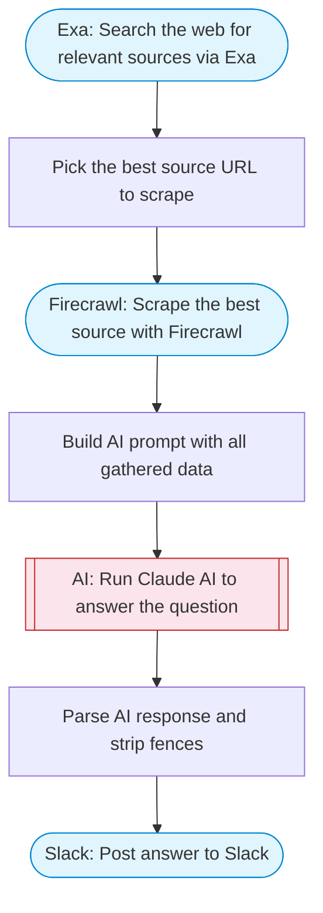

# Chat with Any Data — Exa Search + Firecrawl Scrape + AI

Ask a question about any topic: Exa searches the web for relevant sources, Firecrawl scrapes the best result for full content, Claude AI answers the question using the gathered data, and posts the answer to Slack.

> **Works with any AI agent.** Paste this page's URL into Claude Code, Codex, Cursor, Windsurf, OpenClaw, or any coding agent — it will read the docs, connect your platforms, and run this flow for you.

## Quick Start

```bash
# 1. Connect your platforms (one-time setup)
one add exa
one add firecrawl
one add slack

# 2. Run the flow
one flow execute n8n-2026-chat-any-data \
  --input slackChannel="C01ABC123" \
  --input question="your question here"
```

## Platforms

| Platform | Used for |
|----------|----------|
| Exa | Search the web for relevant sources via Exa |
| Firecrawl | Scrape the best source with Firecrawl |
| Slack | Post answer to Slack |

> Don't have these connected yet? Run `one list` to check, then `one add <platform>` to connect.

## What it does

1. Search the web for relevant sources via Exa
2. Pick the best source URL to scrape
3. Scrape the best source with Firecrawl
4. Build AI prompt with all gathered data
5. Run Claude AI to answer the question
6. Parse AI response and strip fences
7. Post answer to Slack

## Flow diagram



## Inputs

| Input | Required | Description |
|-------|----------|-------------|
| `slackChannel` | Yes | Slack channel ID to post the answer |
| `question` | Yes | The question you want answered (e.g. 'What are the latest trends in AI agents?') |

---

<sub>Based on [n8n #2026](https://n8n.io/workflows/2026) · 44.6K views on n8n · by [davidn8n](https://n8n.io/creators/davidn8n) · Converted to One CLI on 2026-03-25</sub>
