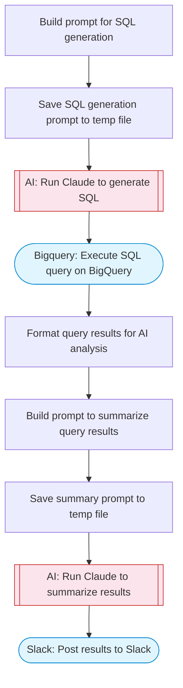

# Chat with a database using AI

Ask questions about data in a BigQuery database using natural language. Takes a question and database context, uses Claude to generate a SQL query, executes it via BigQuery, then uses Claude again to summarize the results in plain English. Results are posted to Slack with Block Kit formatting.

> **Works with any AI agent.** Paste this page's URL into Claude Code, Codex, Cursor, Windsurf, OpenClaw, or any coding agent — it will read the docs, connect your platforms, and run this flow for you.

## Quick Start

```bash
# 1. Connect your platforms (one-time setup)
one add bigquery
one add slack

# 2. Run the flow
one flow execute n8n-2090-chat-database \
  --input question="your question here" \
  --input projectId="..." \
  --input datasetId="..." \
  --input schemaHint="..." \
  --input slackChannel="C01ABC123"
```

## Platforms

| Platform | Used for |
|----------|----------|
| Bigquery | Execute SQL query on BigQuery |
| Slack | Posting results |

> Don't have these connected yet? Run `one list` to check, then `one add <platform>` to connect.

## What it does

1. Build prompt for SQL generation
2. Save SQL generation prompt to temp file
3. Run Claude to generate SQL
4. Execute SQL query on BigQuery
5. Format query results for AI analysis
6. Build prompt to summarize query results
7. Save summary prompt to temp file
8. Run Claude to summarize results
9. Post results to Slack

## Flow diagram



## Inputs

| Input | Required | Description |
|-------|----------|-------------|
| `question` | Yes | Natural language question about the data |
| `projectId` | Yes | BigQuery project ID |
| `datasetId` | Yes | BigQuery dataset ID |
| `schemaHint` | No | Optional schema description (table names, columns, types) to help AI generate accurate SQL |
| `slackChannel` | Yes | Slack channel ID to post the answer |

---

<sub>Based on [n8n #2090](https://n8n.io/workflows/2090) · 261.5K views on n8n · by [davidn8n](https://n8n.io/creators/davidn8n) · Converted to One CLI on 2026-03-24</sub>
