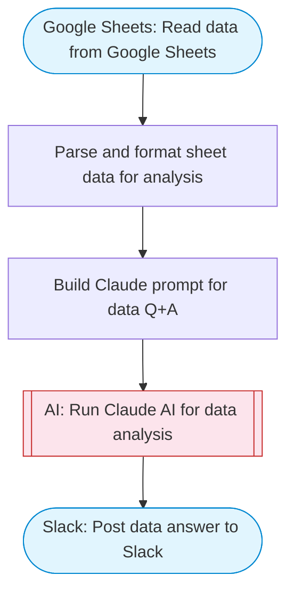

# Chat with Google Sheets data

Reads data from a Google Sheets spreadsheet, uses Claude to answer natural language questions about the data, and posts the answer to Slack with rich Block Kit formatting including data summaries and insights.

> **Works with any AI agent.** Paste this page's URL into Claude Code, Codex, Cursor, Windsurf, OpenClaw, or any coding agent — it will read the docs, connect your platforms, and run this flow for you.

## Quick Start

```bash
# 1. Connect your platforms (one-time setup)
one add google-sheets
one add slack

# 2. Run the flow
one flow execute n8n-2085-chat-google-sheet \
  --input spreadsheetId="..." \
  --input range="..." \
  --input question="your question here" \
  --input slackChannel="C01ABC123"
```

## Platforms

| Platform | Used for |
|----------|----------|
| Google Sheets | Reading data |
| Slack | Posting answers |

> Don't have these connected yet? Run `one list` to check, then `one add <platform>` to connect.

## What it does

1. Read data from Google Sheets
2. Parse and format sheet data for analysis
3. Build Claude prompt for data Q&A
4. Run Claude AI for data analysis
5. Post data answer to Slack

## Flow diagram



## Inputs

| Input | Required | Description |
|-------|----------|-------------|
| `spreadsheetId` | Yes | Google Sheets spreadsheet ID (from the URL) |
| `range` | Yes | Sheet range to read (e.g. 'Sheet1!A1:Z1000') |
| `question` | Yes | Natural language question about the spreadsheet data |
| `slackChannel` | Yes | Slack channel ID to post the answer |

---

<sub>Based on [n8n #2085](https://n8n.io/workflows/2085) · 61.8K views on n8n · by [davidn8n](https://n8n.io/creators/davidn8n) · Converted to One CLI on 2026-03-25</sub>
