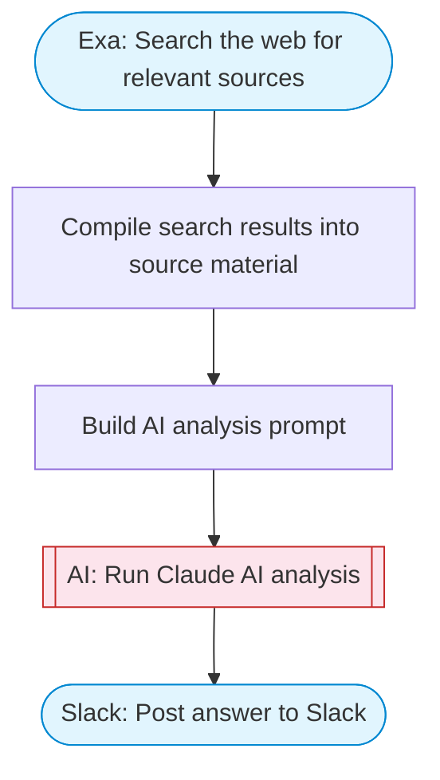

# AI Research Chat — Ask a Question, Get an Answer

Ask any question, search the web for relevant sources via Exa, have Claude AI analyze the findings, and post a well-sourced answer to Slack. A simple question-answering pipeline.

> **Works with any AI agent.** Paste this page's URL into Claude Code, Codex, Cursor, Windsurf, OpenClaw, or any coding agent — it will read the docs, connect your platforms, and run this flow for you.

## Quick Start

```bash
# 1. Connect your platforms (one-time setup)
one add exa
one add slack

# 2. Run the flow
one flow execute n8n-2384-chat-local-llms \
  --input question="your question here" \
  --input slackChannel="C01ABC123"
```

## Platforms

| Platform | Used for |
|----------|----------|
| Exa | Search the web for relevant sources |
| Slack | Post answer to Slack |

> Don't have these connected yet? Run `one list` to check, then `one add <platform>` to connect.

## What it does

1. Search the web for relevant sources
2. Compile search results into source material
3. Build AI analysis prompt
4. Run Claude AI analysis
5. Post answer to Slack

## Flow diagram



## Inputs

| Input | Required | Description |
|-------|----------|-------------|
| `question` | Yes | The question you want answered |
| `slackChannel` | Yes | Slack channel ID to post the answer |

---

<sub>Based on [n8n #2384](https://n8n.io/workflows/2384) · 186.8K views on n8n · by [mihailtd](https://n8n.io/creators/mihailtd) · Converted to One CLI on 2026-03-24</sub>
