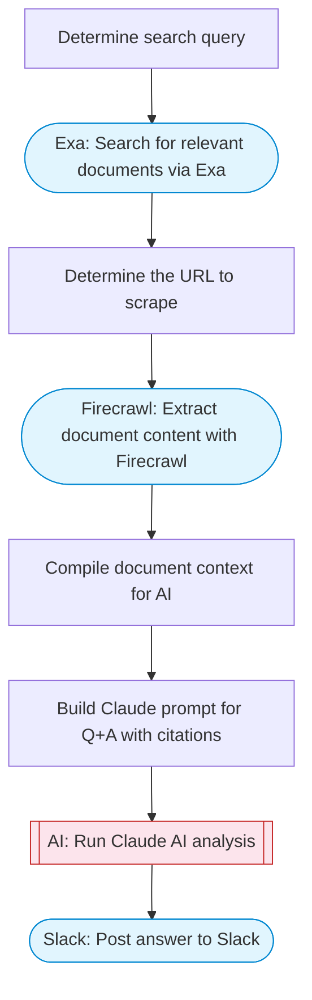

# Chat with PDF docs using AI (quoting sources)

Searches Google Drive for documents, uses Firecrawl to extract content from a document URL, then Claude AI answers a user question with source citations. Posts the answer to Slack using Block Kit formatting.

> **Works with any AI agent.** Paste this page's URL into Claude Code, Codex, Cursor, Windsurf, OpenClaw, or any coding agent — it will read the docs, connect your platforms, and run this flow for you.

## Quick Start

```bash
# 1. Connect your platforms (one-time setup)
one add exa
one add firecrawl
one add slack

# 2. Run the flow
one flow execute n8n-2165-chat-pdf-sources \
  --input slackChannel="C01ABC123" \
  --input question="your question here" \
  --input documentUrl="https://example.com" \
  --input searchQuery="your question here"
```

## Platforms

| Platform | Used for |
|----------|----------|
| Exa | Document search |
| Firecrawl | Content extraction |
| Slack | Post answer to Slack |

> Don't have these connected yet? Run `one list` to check, then `one add <platform>` to connect.

## What it does

1. Determine search query
2. Search for relevant documents via Exa
3. Determine the URL to scrape
4. Extract document content with Firecrawl
5. Compile document context for AI
6. Build Claude prompt for Q&A with citations
7. Run Claude AI analysis
8. Post answer to Slack

## Flow diagram



## Inputs

| Input | Required | Description |
|-------|----------|-------------|
| `slackChannel` | Yes | Slack channel to post the answer |
| `question` | Yes | Question to ask about the documents |
| `documentUrl` | No | Direct URL to a document or webpage to analyze. If not provided, Exa search is used to find relevant sources. |
| `searchQuery` | No | Search query to find documents via Exa (used when documentUrl is not provided) |

---

<sub>Based on [n8n #2165](https://n8n.io/workflows/2165) · 116.5K views on n8n · by [davidn8n](https://n8n.io/creators/davidn8n) · Converted to One CLI on 2026-03-24</sub>
