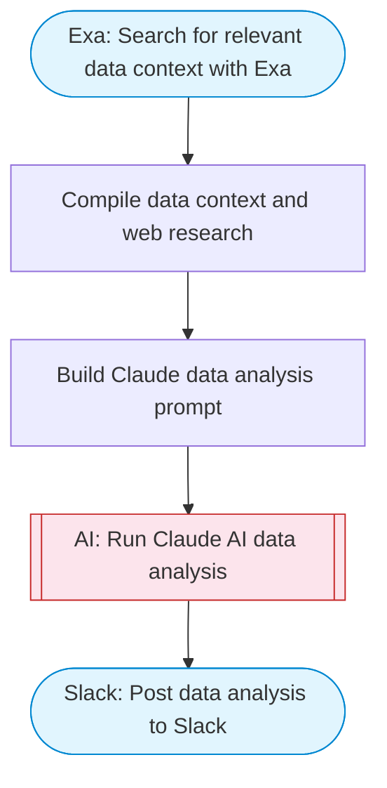

# Chat with database via Claude (adapted: data analysis to Slack)

Takes a natural language question about data, uses Claude AI to generate analysis insights, and posts the results to Slack. Adapted from the n8n PostgreSQL chat concept to work as an AI-powered data analysis assistant.

> **Works with any AI agent.** Paste this page's URL into Claude Code, Codex, Cursor, Windsurf, OpenClaw, or any coding agent — it will read the docs, connect your platforms, and run this flow for you.

## Quick Start

```bash
# 1. Connect your platforms (one-time setup)
one add exa
one add slack

# 2. Run the flow
one flow execute n8n-2164-chat-postgresql \
  --input slackChannel="C01ABC123" \
  --input question="your question here" \
  --input dataContext="..."
```

## Platforms

| Platform | Used for |
|----------|----------|
| Exa | Web research on data topics |
| Slack | Post data analysis to Slack |

> Don't have these connected yet? Run `one list` to check, then `one add <platform>` to connect.

## What it does

1. Search for relevant data context with Exa
2. Compile data context and web research
3. Build Claude data analysis prompt
4. Run Claude AI data analysis
5. Post data analysis to Slack

## Flow diagram



## Inputs

| Input | Required | Description |
|-------|----------|-------------|
| `slackChannel` | Yes | Slack channel to post the analysis |
| `question` | Yes | Natural language question about data or a topic to analyze |
| `dataContext` | No | Optional context data (CSV, JSON, or description of data to analyze) (default: ) |

---

<sub>Based on [n8n #2164](https://n8n.io/workflows/2859) · 85.7K views on n8n · by [yulia](https://n8n.io/creators/yulia) · Converted to One CLI on 2026-03-25</sub>
