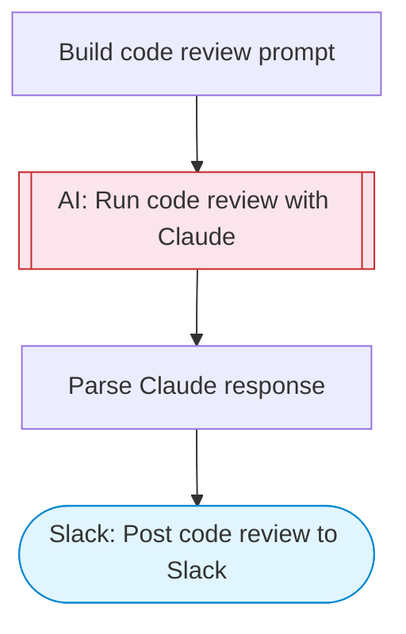

# AI Code Review Analyzer

Submit a code snippet or file for Claude AI to review. Gets a thorough analysis covering bugs, security issues, performance, style, and improvement suggestions, posted to Slack.

> **Works with any AI agent.** Paste this page's URL into Claude Code, Codex, Cursor, Windsurf, OpenClaw, or any coding agent — it will read the docs, connect your platforms, and run this flow for you.

## Quick Start

```bash
# 1. Connect your platforms (one-time setup)
one add slack

# 2. Run the flow
one flow execute n8n-2167-code-review-analyzer \
  --input slackChannel="C01ABC123" \
  --input code="..." \
  --input language="..." \
  --input context="..." \
  --input focusAreas="..."
```

## Platforms

| Platform | Used for |
|----------|----------|
| Slack | Post code review to Slack |

> Don't have these connected yet? Run `one list` to check, then `one add <platform>` to connect.

## What it does

1. Build code review prompt
2. Run code review with Claude
3. Parse Claude response
4. Post code review to Slack

## Flow diagram



## Inputs

| Input | Required | Description |
|-------|----------|-------------|
| `slackChannel` | Yes | Slack channel ID to post the code review |
| `code` | Yes | Code snippet or code content to review |
| `language` | No | Programming language (e.g. 'python', 'javascript', 'go'). Leave blank for auto-detection. (default: auto-detect) |
| `context` | No | Additional context about the code (e.g. 'This is a REST API handler', 'Part of a payment processing pipeline') (default: ) |
| `focusAreas` | No | Comma-separated review focus areas (default: bugs,security,performance,readability) |

---

<sub>Based on [n8n #2167](https://n8n.io/workflows/2167) · 33.0K views on n8n · by [assert](https://n8n.io/creators/assert) · Converted to One CLI on 2026-03-25</sub>
