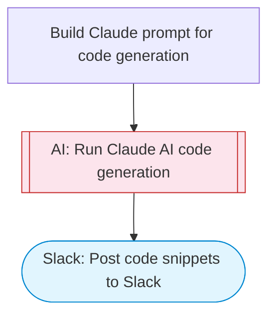

# AI Code Snippet Generator

Takes a coding topic or problem description, uses Claude AI to generate well-documented code examples with explanations in the requested programming language, and posts the result to Slack with Block Kit formatting. Adapted from n8n's interactive JavaScript tutorial workflow.

> **Works with any AI agent.** Paste this page's URL into Claude Code, Codex, Cursor, Windsurf, OpenClaw, or any coding agent — it will read the docs, connect your platforms, and run this flow for you.

## Quick Start

```bash
# 1. Connect your platforms (one-time setup)
one add slack

# 2. Run the flow
one flow execute n8n-5407-code-snippet-generator \
  --input slackChannel="C01ABC123" \
  --input codingTask="..." \
  --input language="..." \
  --input difficulty="..."
```

## Platforms

| Platform | Used for |
|----------|----------|
| Slack | Posting code snippets |

> Don't have these connected yet? Run `one list` to check, then `one add <platform>` to connect.

## What it does

1. Build Claude prompt for code generation
2. Run Claude AI code generation
3. Post code snippets to Slack

## Flow diagram



## Inputs

| Input | Required | Description |
|-------|----------|-------------|
| `slackChannel` | Yes | Slack channel ID to post the code examples |
| `codingTask` | Yes | Description of the coding task or concept (e.g. 'Binary search implementation', 'React useEffect patterns') |
| `language` | No | Programming language for the code examples (JavaScript, Python, TypeScript, Go, etc.) (default: JavaScript) |
| `difficulty` | No | Difficulty level: beginner, intermediate, advanced (default: intermediate) |

---

<sub>Based on [n8n #5407](https://n8n.io/workflows/5407) · 48.2K views on n8n · by [lucaspeyrin](https://n8n.io/creators/lucaspeyrin) · Converted to One CLI on 2026-03-25</sub>
